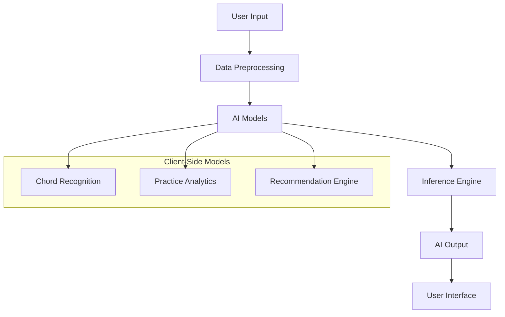

# AI Features Documentation

## 1. Overview

AirChord's AI features provide intelligent assistance for chord recognition, practice optimization, and musical guidance. All AI processing runs client-side using TensorFlow.js and MediaPipe, ensuring privacy and offline capability.

---

## 2. AI Architecture



---

## 3. AI Chord Assistant

### 3.1 Real-Time Chord Suggestion

The AI analyzes the current chord progression and suggests the next chord:

```typescript
interface ChordSuggestion {
  chord: string;
  confidence: number;
  reason: string; // e.g., "Common in I-IV-V progression"
  alternatives: string[];
}
```

### 3.2 Suggestion Algorithm

```
Current Progression: [C, F, G]
    ↓
Analyze Pattern: I-IV-V progression in key of C
    ↓
Predict Next: C (return to I) with 85% confidence
    ↓
Alternatives: Am (vi), Em (iii)
```

### 3.3 Genre-Aware Suggestions

| Genre | Preferred Progressions |
|-------|----------------------|
| Pop | I-V-vi-IV, I-IV-V |
| Rock | I-bVII-IV, I-IV-bVII |
| Jazz | ii-V-I, I-vi-ii-V |
| Blues | I-I-I-I-IV-IV-I-I-V-IV-I-V |
| Country | I-IV-V, I-V-IV |
| Folk | I-IV-V-I, I-vi-IV-V |

---

## 4. Key Detection

### 4.1 Automatic Key Detection

```typescript
function detectKey(chords: string[]): KeyDetection {
  // Analyze chord frequency and tonal center
  const chordFreq = countChordFrequency(chords);
  const tonalCenter = findTonalCenter(chordFreq);
  
  return {
    key: tonalCenter,
    mode: detectMode(chords), // major or minor
    confidence: 0.85,
    suggestions: generateTranspositions(tonalCenter)
  };
}
```

### 4.2 Key Signature Display

| Key | Sharps/Flats | Relative Minor |
|-----|--------------|----------------|
| C | 0 | Am |
| G | 1# | Em |
| D | 2# | Bm |
| A | 3# | F#m |
| E | 4# | C#m |
| F | 1b | Dm |
| Bb | 2b | Gm |
| Eb | 3b | Cm |

---

## 5. Capo Recommendation

### 5.1 Smart Capo Suggestion

```typescript
function recommendCapo(song: Song, userSkill: SkillLevel): CapoRecommendation {
  const currentKey = song.key;
  const difficulty = estimateDifficulty(song.chords, userSkill);
  
  // Find capo position that simplifies chord shapes
  for (let fret = 0; fret <= 12; fret++) {
    const transposedChords = transposeChords(song.chords, -fret);
    const newDifficulty = estimateDifficulty(transposedChords, userSkill);
    
    if (newDifficulty < difficulty) {
      return {
        capoFret: fret,
        newKey: transposeKey(currentKey, -fret),
        reason: `Simplifies chord shapes (difficulty: ${difficulty} → ${newDifficulty})`,
        easyChords: transposedChords
      };
    }
  }
  
  return { capoFret: 0, reason: "Current shapes are already optimal" };
}
```

### 5.2 Capo Recommendation Examples

| Original Key | Suggested Capo | New Shapes | Reason |
|--------------|----------------|------------|--------|
| B Major | Fret 4 | G shapes | Easier chord shapes |
| Eb Major | Fret 3 | C shapes | Common open chords |
| F# Major | Fret 2 | E shapes | Simpler fingering |
| Ab Major | Fret 1 | G shapes | Easier barre chords |

---

## 6. Strumming Recommendation

### 6.1 Pattern Suggestion

```typescript
function recommendStrumPattern(
  song: Song,
  skillLevel: SkillLevel,
  tempo: number
): StrumPattern {
  const genre = song.genre[0];
  const timeSignature = song.timeSig;
  
  // Match pattern to genre and skill level
  const patterns = getPatternsForGenre(genre);
  const suitable = patterns.filter(p => 
    p.difficulty <= skillLevel &&
    p.timeSignature === timeSignature
  );
  
  return suitable[0] || getDefaultPattern(timeSignature);
}
```

### 6.2 Strum Pattern Library

| Pattern | Genre | Difficulty | Tempo Range |
|---------|-------|------------|-------------|
| Basic Down | All | Beginner | 60-120 |
| Folk Strum | Folk, Pop | Beginner | 80-140 |
| Rock Strum | Rock, Pop | Intermediate | 100-180 |
| Blues Shuffle | Blues | Intermediate | 80-160 |
| Jazz Swing | Jazz | Advanced | 100-200 |
| Fingerpick | Folk, Classical | Advanced | 60-120 |

---

## 7. Practice Coach

### 7.1 Real-Time Feedback

```typescript
interface PracticeFeedback {
  type: 'correct' | 'incorrect' | 'suggestion';
  message: string;
  metric?: string;
  value?: number;
}
```

### 7.2 Feedback Types

| Trigger | Feedback |
|---------|----------|
| Correct chord on beat | "Perfect! 🎵" |
| Late chord change | "Try switching a bit earlier" |
| Wrong chord | "That was {wrong}, try {correct}" |
| Rushing | "Slow down, you're ahead of the beat" |
| Dragging | "You're a bit behind, listen to the metronome" |
| Good streak | "5 in a row! Keep it up! 🔥" |
| Pattern detected | "Nice folk strum pattern!" |

### 7.3 Post-Session Analysis

```
Practice Session Complete!

Duration: 15 minutes
Chords Practiced: C, G, Am, F
Average Score: 82%

Strengths:
  ✅ C → G transition (95% accuracy)
  ✅ Timing consistency (±12ms)

Areas for Improvement:
  ⚠️ F barre chord (68% accuracy)
  ⚠️ Am → F transition (timing gaps)

Recommendations:
  💡 Practice F chord shape isolation
  💡 Slow down to 80 BPM for F transitions
  💡 Try capo on fret 3 for easier F shape
```

---

## 8. Mistake Detection

### 8.1 Error Patterns

```typescript
interface MistakePattern {
  type: 'chord' | 'timing' | 'strum' | 'transition';
  frequency: number;
  severity: 'low' | 'medium' | 'high';
  suggestion: string;
}
```

### 8.2 Common Mistake Detection

| Mistake | Detection | Suggestion |
|---------|-----------|------------|
| Wrong chord shape | Gesture mismatch | Review chord diagram |
| Rushing | Consistently early | Practice with slower tempo |
| Dragging | Consistently late | Focus on beat anticipation |
| Incomplete strum | Not all strings triggered | Check hand position |
| Weak barre chord | Low confidence on barre | Strengthen finger pressure |

---

## 9. Difficulty Estimation

### 9.1 Song Difficulty Scoring

```typescript
function estimateSongDifficulty(song: Song): DifficultyScore {
  const factors = {
    chordComplexity: analyzeChordComplexity(song.chords),
    transitionSpeed: analyzeTransitionSpeed(song.chords),
    tempoComplexity: analyzeTempo(song.tempo),
    rhythmComplexity: analyzeRhythm(song.timeSig),
    barreChordCount: countBarreChords(song.chords),
  };

  return {
    overall: calculateWeightedScore(factors),
    breakdown: factors,
    estimatedSkillLevel: mapToSkillLevel(factors),
  };
}
```

### 9.2 Difficulty Levels

| Level | Chords | Tempo | Transitions |
|-------|--------|-------|-------------|
| Beginner | Open major/minor | 60-100 BPM | Slow, simple |
| Intermediate | 7ths, easy barre | 80-140 BPM | Moderate |
| Advanced | Complex barre, jazz | 100-180 BPM | Fast, complex |
| Expert | Extended chords, odd time | 120-240 BPM | Very fast |

---

## 10. Future AI Features

### 10.1 Voice Assistant (Phase 8)

```
User: "Hey AirChord, play a C major chord"
AI: "Playing C major at 120 BPM"
[Chord plays]
User: "Now switch to G"
AI: "Switching to G major"
[G chord plays]
```

### 10.2 AI Band (Phase 9)

```typescript
interface AIBand {
  drums: DrumPattern;
  bass: BassLine;
  piano: PianoAccompaniment;
  strings: StringSection;
}

// AI generates accompanying instruments based on:
// - Current chord progression
// - Selected genre
// - User's tempo
// - Dynamic intensity
```

### 10.3 Song Transcription (Phase 8)

- Upload audio file → AI detects chords
- Auto-generate chord chart
- Suggest strumming pattern
- Estimate difficulty

### 10.4 Personalized Learning Path (Phase 9)

```typescript
interface LearningPath {
  currentLevel: SkillLevel;
  targetLevel: SkillLevel;
  weeklyPlan: PracticeDay[];
  estimatedTimeline: number; // weeks
  focusAreas: string[];
}
```

---

## 11. AI Model Management

### 11.1 Model Sizes

| Model | Size | Load Time | Accuracy |
|-------|------|-----------|----------|
| Chord Recognition | 2.5 MB | <1s | 95% |
| Gesture Classification | 1.8 MB | <1s | 93% |
| Practice Analytics | 0.5 MB | <0.5s | 90% |
| Key Detection | 0.3 MB | <0.5s | 88% |
| Voice Intensity | 0.4 MB | <0.5s | 92% |

### 11.2 Model Updates

- Models loaded from CDN on app start
- Cached offline via Service Worker
- Updated monthly with improved accuracy
- A/B testing for new model versions

### 11.3 Privacy

- All inference runs client-side
- No user data sent to servers (unless opted-in)
- Anonymous usage analytics only
- GDPR/CCPA compliant

---

## 12. Dynamic Band AI

The Dynamic Band is AirChord's signature AI feature. It analyzes the singer's voice in real-time and adjusts the entire accompaniment to match.

### 12.1 Voice Intensity Analysis

```typescript
interface VoiceAnalysis {
  // Real-time FFT analysis
  rmsLevel: number;          // Current volume (dB)
  peakLevel: number;         // Peak volume (dB)
  frequencyCentroid: number; // Brightness of voice

  // Classification
  intensity: 'silence' | 'soft' | 'medium' | 'loud';
  confidence: number;        // 0-1

  // Smoothing
  envelope: number[];        // History for smooth transitions
  attackTime: number;        // ms to ramp up
  releaseTime: number;       // ms to ramp down
}
```

### 12.2 Intensity Mapping

| Voice Level | dB Range | Guitar | Drums | Bass | Strings |
|-------------|----------|--------|-------|------|---------|
| Silence | < -40 dB | Sustain/decay | None | Pedal note | Fade out |
| Soft | -40 to -30 dB | Gentle fingerpick | Light hi-hat | Root notes | Soft pad |
| Medium | -30 to -15 dB | Full strum | Standard pattern | Walking bass | Medium swell |
| Loud | > -15 dB | Power strums | Driving pattern | Active lines | Full section |

### 12.3 Smooth Transitions

```typescript
class DynamicBandAI {
  // Prevent abrupt changes
  private transitionRamp = 200; // ms exponential ramp

  updateInstrumentResponse(analysis: VoiceAnalysis) {
    const targetVelocity = this.mapIntensityToVelocity(analysis.intensity);

    // Exponential ramp for natural feel
    this.guitarGain.gain.exponentialRampToValueAtTime(
      targetVelocity,
      this.audioContext.currentTime + this.transitionRamp / 1000
    );

    // Switch drum pattern on next beat (not mid-beat)
    this.drumEngine.schedulePatternChange(
      this.getPatternForIntensity(analysis.intensity),
      this.tempoController.nextBeatTime()
    );
  }
}
```

### 12.4 User Controls

| Control | Range | Default |
|---------|-------|---------|
| Dynamic Sensitivity | 0.1-1.0 | 0.5 |
| Reaction Speed | Slow/Medium/Fast | Medium |
| Min Intensity | Soft/Medium | Soft |
| Max Intensity | Medium/Loud | Loud |
| Band Size | Solo/Duo/Full Band | Full Band |
