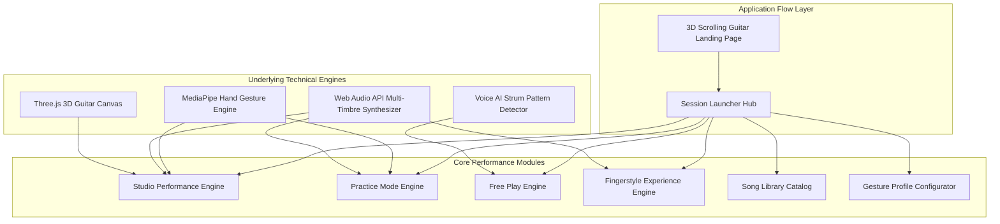

# Complete System Architecture: AirChord Performance Studio

## AirChord Core Architecture

---

## 🏗️ Core Session Workflows

### 1. Session Launcher Hub (`SessionLauncher.tsx`)
- Central entry portal after launching AirChord.
- Provides 6 primary session modes:
  1. **Studio Performance** (`StudioPerformance.tsx`)
  2. **Practice Mode** (`PracticeMode.tsx`)
  3. **Free Play** (`Studio.tsx`)
  4. **Fingerstyle Experience** (`FingerstyleLounge.tsx`)
  5. **Song Library Catalog** (`SongLibraryModal.tsx`)
  6. **Gesture Profiles** (`ProfileEditorModal.tsx`)

### 2. Studio Performance Mode Architecture (`StudioPerformance.tsx`)
- **Asymmetrical 3-Column Layout**:
  - **Left**: Webcam feed, MediaPipe hand tracking skeleton, active gesture badge (`✋ = G`), confidence score (`98%`).
  - **Center**: Interactive 3D Three.js guitar with string vibration physics & fret highlights.
  - **Right**:
    - *Logic Pro Teleprompter*: Stacked lines (`Current`, `Next`, `Upcoming`).
    - *Chord Cascade*: Stacked upcoming chord progression (`Current: G` → `Next: Em` → `After: C`).
  - **Bottom Timeline**: Song section indicator (`Verse/Chorus`), BPM, and live beat strum indicator.
- **Non-stop Performance Engine**: Timeline continues playing detected chord without pausing during live studio performance.

### 3. Practice Mode Architecture (`PracticeMode.tsx`)
- **Pause-on-Error Engine**:
  - Compares user's played gesture chord with target expected chord.
  - If expected chord is `C` but user plays `Am`, progression pauses immediately with diagnostic alert (`Expected: C | Detected: Am — Try Again`).
  - Advances step only when correct chord is played.
- **Performance Scorecard**:
  - Chord Accuracy %
  - Timing Accuracy %
  - Wrong Chords Count
  - Average Detection Latency (ms)

### 4. Fingerstyle Experience Architecture (`FingerstyleLounge.tsx`)
- **Learn Fingerstyle**: Guided `P-I-M-A` (Thumb, Index, Middle, Ring) picking lessons and string targeting.
- **Relax & Listen (Ambient Lounge)**: Camera-free audio lounge featuring continuous acoustic guitar fingerstyle playback across 6 ambient themes (*Night Lounge*, *Rainy Evening*, *Campfire*, *Forest Whispers*, *Ocean Waves*, *Acoustic Sunset*).

### 5. Extensible Song Database Schema (`songLibrary.ts`)
- Scalable JSON schema supporting thousands of songs across collections (*Hindi*, *English*, *Bollywood*, *Pop*, *Rock*, *Indie*, *Campfire*, *Worship*, *Beginner*, *Advanced*).
- Seeded with songs (*Perfect*, *Tum Hi Ho*, *Kesariya*, *Hotel California*, *Apna Bana Le*, *Riptide*, *Hallelujah*).

---

## ⚡ Performance Optimizations

1. **Hardware-Synced Hand Tracking**:
   - `lastVideoTimeRef` timestamp verification in `useHandTracking.ts` ensures MediaPipe inferencing runs strictly when video frames advance.
2. **Dynamic Pixel Ratio Capping**:
   - Capped Three.js WebGL Renderer DPR to `Math.min(window.devicePixelRatio, 1.5)` to prevent GPU bottlenecking on 4K screens.
3. **Instant App Loading**:
   - Bypassed artificial splash screen delays and lazy-loaded vision ML models only when launching live tracking modes.