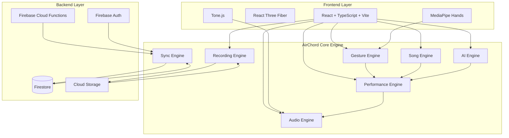
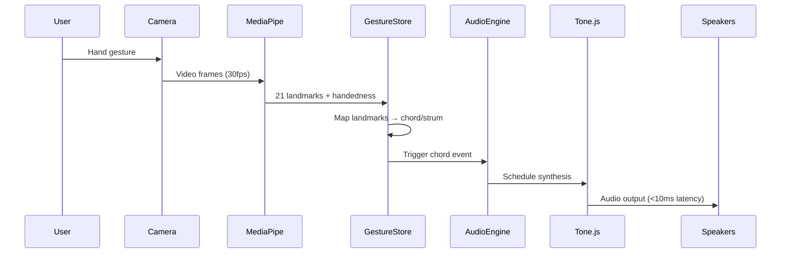
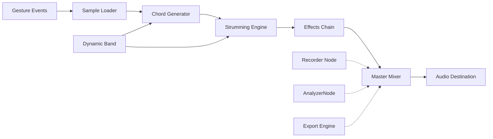
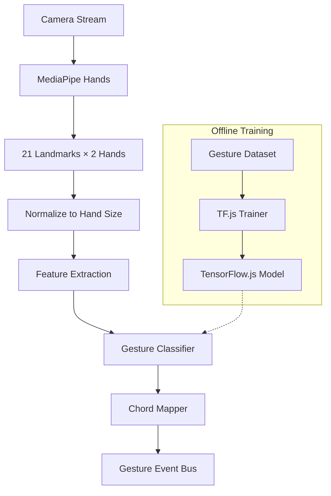
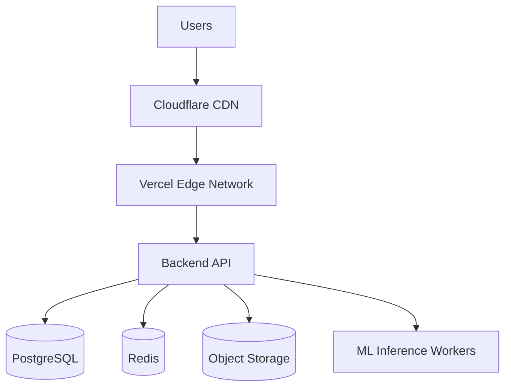

# Complete System Architecture

## AirChord Core Engine

Every feature plugs into one of these engines. This is the central architectural concept.



### Engine Responsibilities

| Engine | Responsibility | Key Dependencies |
|--------|---------------|------------------|
| **Gesture Engine** | Hand detection, gesture classification, calibration | MediaPipe Hands, TensorFlow.js |
| **Performance Engine** | Orchestrates gesture→chord→audio pipeline, adaptive tempo | Gesture Engine, Audio Engine, Song Engine |
| **Audio Engine** | Synthesis, mixing, effects, instrument plugins | Tone.js, Web Audio API |
| **Recording Engine** | Voice/video capture, .air project format, export | MediaRecorder, FFmpeg.wasm |
| **Song Engine** | Song storage, chord timeline, lyrics sync, provider pattern | Firestore, parsers |
| **AI Engine** | Practice coach, adaptive performance, mistake detection | TensorFlow.js, analytics |
| **Sync Engine** | Cross-device sync, offline queue, conflict resolution | Firestore, IndexedDB |

### Plugin Architecture (Instruments)

```
Instrument Plugin Interface
├── Acoustic Guitar (Karplus-Strong)
├── Electric Guitar (Karplus-Strong + Amp Sim)
├── Bass Guitar (Karplus-Strong Low)
├── Ukulele (Karplus-Strong High)
├── Piano (Additive Synthesis)
├── Drums (Sample Playback)
├── Strings (Granular Synthesis)
└── [Future Plugins...]
```

Each instrument implements:

```typescript
interface InstrumentPlugin {
  name: string;
  type: 'string' | 'keyboard' | 'percussion' | 'wind';
  tunings: string[];
  loadSamples(): Promise<void>;
  playNote(note: string, velocity: number): void;
  playChord(chord: string, strumDelay: number): void;
  setEffects(effects: EffectChain): void;
  export(): AudioBuffer;
}
```

---

## Frontend Architecture

### Stack
- **Framework**: React 18 + TypeScript 5
- **Build Tool**: Vite 5 (fast HMR, optimized production builds)
- **State Management**: Zustand (lightweight, SSR-friendly) + React Query (server state)
- **Routing**: React Router v6 (nested routes, lazy loading)
- **Styling**: Tailwind CSS + CSS Variables for theming
- **Animations**: Framer Motion (declarative, spring physics)
- **3D**: React Three Fiber + Drei (React-native Three.js wrapper)

### Component Architecture

```
src/
├── components/
│   ├── ui/           # Atomic design system (Button, Card, Modal, etc.)
│   ├── layout/       # Layout components (Header, Footer, Sidebar)
│   ├── features/     # Feature-specific components
│   │   ├── camera/   # CameraView, HandOverlay, CalibrationGuide
│   │   ├── audio/    # Mixer, InstrumentSelector, StrumPattern
│   │   ├── chords/   # ChordGrid, ChordDiagram, ProgressionView
│   │   ├── recorder/ # RecordButton, Waveform, ExportModal
│   │   ├── practice/ # Metronome, CoachFeedback, ProgressChart
│   │   └── library/  # SongCard, SearchBar, FilterPanel
│   └── 3d/           # GuitarModel, HandModel, ParticleEffects
├── hooks/            # Custom React hooks (useMediaPipe, useAudioEngine, etc.)
├── stores/           # Zustand stores (audioStore, gestureStore, userStore)
├── services/         # API clients, WebSocket managers
├── utils/            # Helpers (audioUtils, gestureUtils, dateUtils)
└── pages/            # Route-level components
```

### Data Flow (Frontend)



---

## Backend Architecture

### Stack
- **Runtime**: Node.js 20 LTS
- **Framework**: Fastify (performance) or Express (familiarity)
- **Language**: TypeScript 5
- **ORM**: Prisma (type-safe database access)
- **Validation**: Zod (schema validation)
- **Auth**: JWT + Refresh Tokens, OAuth 2.0 providers (Google, Apple)
- **Real-time**: Socket.io (for live collaboration, future)

### Service Layer

| Service | Responsibility | Key Dependencies |
|---------|---------------|------------------|
| AuthService | User registration, login, token management | Prisma, Redis, Nodemailer |
| SongService | CRUD songs, chord progressions, search | Prisma, Elasticsearch (future) |
| GestureService | Gesture calibration, custom mappings | MediaPipe (server-side via WASM), TensorFlow.js |
| RecordingService | Handle upload, processing, mixing, export | FFmpeg.wasm, S3, Redis queue |
| PracticeService | Session tracking, analytics, coaching | Prisma, Analytics DB |
| UserService | Profile, preferences, subscriptions | Prisma, Stripe (future) |

### API Design

RESTful endpoints with predictable conventions:
- `GET /api/v1/songs` — List with pagination, filters
- `POST /api/v1/songs` — Create (auth required)
- `GET /api/v1/songs/:id` — Detail
- `PATCH /api/v1/songs/:id` — Update
- `DELETE /api/v1/songs/:id` — Delete
- `POST /api/v1/recordings` — Initiate multipart upload
- `GET /api/v1/recordings/:id/status` — Poll processing status

WebSocket events (future):
- `song:collaborate:join`
- `gesture:broadcast`
- `recording:progress`

---

## Database Architecture

### PostgreSQL Schema (Prisma)

```prisma
model User {
  id            String    @id @default(cuid())
  email         String    @unique
  passwordHash  String?
  name          String?
  avatarUrl     String?
  provider      String?   // "email", "google", "apple"
  providerId    String?
  createdAt     DateTime  @default(now())
  updatedAt     DateTime  @updatedAt
  songs         Song[]
  recordings    Recording[]
  practices     PracticeSession[]
  preferences   Preferences?
  @@index([email])
}

model Song {
  id          String   @id @default(cuid())
  title       String
  artist      String?
  key         String   // e.g., "C", "Gb"
  tempo       Int      // BPM
  timeSig     String   // "4/4", "3/4"
  difficulty  Int      // 1-5
  genre       String[]
  chords      Json     // [{chord: "C", duration: 4, measure: 1}, ...]
  lyrics      String?  // Future: licensed content
  isPublic    Boolean  @default(false)
  createdById String
  createdBy   User     @relation(fields: [createdById], references: [id])
  createdAt   DateTime @default(now())
  updatedAt   DateTime @updatedAt
  @@index([createdById])
  @@index([title])
}

model Recording {
  id          String   @id @default(cuid())
  title       String
  userId      String
  user        User     @relation(fields: [userId], references: [id])
  songId      String?
  song        Song?    @relation(fields: [songId], references: [id])
  audioUrl    String   // S3 path
  videoUrl    String?  // S3 path (optional)
  duration    Float    // seconds
  format      String   // "mp3", "wav", "mp4"
  status      String   // "processing", "ready", "failed"
  metadata    Json?    // {mixLevels, effects, tempo}
  createdAt   DateTime @default(now())
  @@index([userId])
  @@index([songId])
}

model PracticeSession {
  id        String   @id @default(cuid())
  userId    String
  user      User     @relation(fields: [userId], references: [id])
  songId    String?
  song      Song?    @relation(fields: [songId], references: [id])
  duration  Int      // seconds
  score     Float?   // 0-100
  metrics   Json     // {chordAccuracy: 0.85, timingAccuracy: 0.92}
  createdAt DateTime @default(now())
  @@index([userId])
  @@index([createdAt])
}

model Preferences {
  id              String @id @default(cuid())
  userId          String @unique
  user            User   @relation(fields: [userId], references: [id])
  theme           String @default("system") // "light", "dark", "system"
  audioQuality    String @default("high")   // "low", "medium", "high"
  metronomeSound  String @default("click")
  handedness      String @default("right")  // "right", "left", "auto"
  sensitivity     Float  @default(0.8)
  calibrationData Json?  // custom gesture mappings
}
```

### Caching Strategy (Redis)

| Key Pattern | TTL | Purpose |
|-------------|-----|---------|
| `session:{token}` | 7d | Auth token validation |
| `song:search:{query}` | 1h | Search results |
| `song:detail:{id}` | 24h | Song details |
| `user:recordings:{id}` | 1h | User's recent recordings |
| `rate_limit:{ip}:{endpoint}` | 1m | Rate limiting |

---

## Audio Engine Architecture

### Internal Modules



| Module | Responsibility |
|--------|---------------|
| **Sample Loader** | Pre-loads all instrument samples into memory |
| **Chord Generator** | Builds chord voicings from note data |
| **Strumming Engine** | Timing engine with humanize and pattern sequencing |
| **Effects Chain** | Reverb, delay, chorus, compression, EQ |
| **Master Mixer** | Balances instrument, metronome, voice, effects |
| **Dynamic Band** | Responds to voice intensity to adjust arrangement |
| **Recorder Node** | Captures mixed audio for recording |
| **Exporter** | Converts to MP3/WAV/MP4 via FFmpeg.wasm |

### Dynamic Band Engine

The signature feature. The band responds to the singer's voice intensity instead of playing a fixed loop.

```typescript
interface DynamicBandConfig {
  // Voice analysis
  voiceAnalyzer: AnalyserNode;
  sampleWindow: number;        // ms to analyze voice intensity
  smoothingFactor: number;     // 0-1, how fast band reacts

  // Intensity mapping
  softThreshold: number;       // dB level for soft singing
  mediumThreshold: number;     // dB level for medium singing
  loudThreshold: number;       // dB level for loud singing

  // Instrument response
  guitarVelocityScale: [number, number]; // [min, max] velocity
  drumIntensityLevels: DrumPattern[];    // soft, medium, loud patterns
  bassVelocityScale: [number, number];
  stringsSwellRange: [number, number];   // gain range for strings
}
```

```
Voice Input → AnalyserNode (FFT)
    ↓
Intensity Classification:
    Soft (< -30 dB)  → Gentle strum, light drums, soft bass
    Medium (-30 to -15 dB) → Full strum, standard drums
    Loud (> -15 dB)  → Power strums, driving drums, loud bass
    Silence (< -40 dB) → Sustain, decay, sparse notes
    ↓
Smooth Transition (exponential ramp, 200ms)
    ↓
Instrument Response:
    Guitar: Velocity scaling 0.3-1.0
    Drums: Pattern switching (8th notes → 16th notes)
    Bass: Note density scaling
    Strings: Gain swell 0.2-0.8
```

### Tone.js Architecture

```typescript
class GuitarSynth implements InstrumentPlugin {
  name = 'Acoustic Guitar';
  type = 'string';
  private strings: PluckString[];
  private body: Convolver; // Impulse response of guitar body
}

class StrumEngine {
  private pattern: StrumPattern;
  private humanize: number; // 0-1 randomness factor
  private tempoSync: TempoController;
}

class AudioManager {
  static context: AudioContext;
  static masterGain: GainNode;
  static recorder: MediaRecorder | null;
  static dynamicBand: DynamicBandEngine;
}
```

### Latency Budget

| Stage | Target | Max | Optimization |
|-------|--------|-----|--------------|
| Camera Frame Capture | 8ms | 15ms | RequestAnimationFrame sync |
| MediaPipe Processing | 8ms | 15ms | WASM, GPU acceleration |
| Gesture Classification | 3ms | 10ms | Pre-computed lookup tables |
| Chord Scheduling | 2ms | 5ms | Event bus, no async |
| Audio Buffer Start | 3ms | 10ms | Pre-loaded buffers |
| **Total End-to-End** | **24ms** | **< 50ms** | **Must feel like an instrument** |

> **Critical**: If total latency exceeds 50ms, the app feels disconnected from the user's hands. Every optimization decision should prioritize latency.

---

## Gesture Engine Architecture

### Pipeline



### Customization Layer

- User calibration stores custom gesture→chord mappings
- Sensitivity slider adjusts confidence threshold
- Handedness detection auto-flips chord diagrams

---

## Recording Engine Architecture

### Pipeline

```
User Action → Start Recording
    ↓
AudioContext.createMediaStreamDestination() → Capture System Audio + Mic
    ↓
MediaRecorder (audio/webm) → Chunks → Web Worker (FFmpeg.wasm)
    ↓
Processing: Mix, Normalize, Apply Effects, Convert Formats
    ↓
Upload to S3 (multipart) → Database Record Creation
    ↓
Notification → User
```

### Format Support

| Format | Codec | Use Case |
|--------|-------|----------|
| MP3 | LAME 320kbps | Sharing, streaming |
| WAV | PCM 48kHz/24bit | Archival, DAW import |
| MP4 | H.264 + AAC | Social video export |

---

## Security Layer

| Layer | Implementation |
|-------|----------------|
| Transport | TLS 1.3 (HSTS, HPKP) |
| Auth | JWT (RS256) + HttpOnly Secure Cookies |
| API | Rate limiting (100 req/min), Input validation (Zod) |
| Data | AES-256 at rest (S3 SSE), Field-level encryption for PII |
| Camera/Mic | `Permissions-Policy: camera=(self), microphone=(self)` |
| CSP | Strict: `script-src 'self'; object-src 'none'` |
| CORS | Allowlist origins only |

---

## Future Scaling Architecture

### Microservices Decomposition (Phase 2+)

```
API Gateway (Kong/Traefik)
    ├── Auth Service
    ├── Song Service
    ├── Gesture Service (ML-heavy, GPU nodes)
    ├── Recording Service (CPU-heavy, FFmpeg workers)
    ├── Practice/Analytics Service
    ├── Notification Service
    └── Payment/Subscription Service
```

### Event-Driven Architecture

- **Message Broker**: NATS or Kafka
- **Events**: `RecordingCreated`, `SongPublished`, `PracticeCompleted`
- **Saga Pattern**: Multi-step workflows (e.g., recording → process → notify → index)

### CDN & Edge

- Static assets: Cloudflare CDN
- Signed URLs for private recordings
- Edge functions for auth verification

---

## Infrastructure (Current)

| Component | Provider | Notes |
|-----------|----------|-------|
| Frontend Hosting | Vercel | Preview deployments, edge functions |
| Backend Hosting | Railway / Fly.io | WebSocket support, auto-scaling |
| Database | Neon (PostgreSQL) | Serverless, branching |
| Cache | Upstash (Redis) | Serverless, HTTP API |
| Storage | Cloudflare R2 / AWS S3 | S3-compatible, no egress fees |
| CI/CD | GitHub Actions | Lint, test, build, deploy |
| Monitoring | Sentry + LogRocket | Error tracking, session replay |
| Analytics | Plausible / PostHog | Privacy-first |

---

## Deployment Topology

