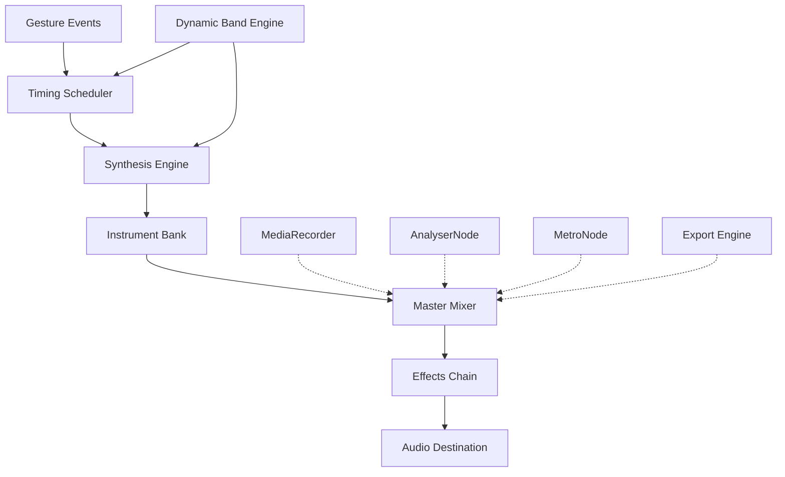

# Audio Engine Documentation

## 1. Overview

AirChord's audio engine delivers studio-quality guitar synthesis with sub-50ms latency. The engine uses Tone.js and the Web Audio API for real-time audio processing, supporting multiple instruments, strumming patterns, capo transposition, and tempo control. All synthesis runs client-side with no server dependency after initial asset loading.

---

## 2. Architecture



### Internal Modules

| Module | Responsibility |
|--------|---------------|
| **Sample Loader** | Pre-loads all instrument samples into memory on app start |
| **Chord Generator** | Builds chord voicings from note arrays + capo offset |
| **Strumming Engine** | Timing engine with humanize factor and pattern sequencing |
| **Effects Chain** | Reverb, delay, chorus, compression, EQ |
| **Master Mixer** | Balances instrument, metronome, voice, effects |
| **Dynamic Band** | Responds to voice intensity to adjust arrangement |
| **Recorder Node** | Captures mixed audio for recording |
| **Exporter** | Converts to MP3/WAV/MP4 via FFmpeg.wasm |

---

## 2.5 Song Timeline Engine

Every song is represented as a **beat-based timeline object**, not plain text. All systems (lyrics, chord display, scrolling, recording, AI) read from this timeline.

### Timeline Object

```typescript
interface SongTimeline {
  id: string;
  title: string;
  key: string;
  tempo: number;           // BPM
  timeSignature: [number, number]; // [beats, subdivision]
  totalBeats: number;

  // Beat-based chord events
  chords: ChordEvent[];

  // Beat-based lyrics (optional)
  lyrics: LyricEvent[];

  // Beat-based strum patterns
  strumming: StrumEvent[];
}

interface ChordEvent {
  beat: number;            // Position in beats (0, 4, 8, 12...)
  chord: string;           // "C", "Am", "G7"
  duration: number;        // In beats (4 = one bar in 4/4)
  bass?: string;           // Optional bass note
}

interface LyricEvent {
  beat: number;
  text: string;
  syllables?: SyllableData[];
}

interface StrumEvent {
  beat: number;
  pattern: StrumPattern;
  intensity: 'soft' | 'medium' | 'loud';
}
```

### Example: "Let It Be" Timeline

```json
{
  "title": "Let It Be",
  "key": "C",
  "tempo": 72,
  "timeSignature": [4, 4],
  "chords": [
    { "beat": 0,  "chord": "C",  "duration": 4 },
    { "beat": 4,  "chord": "G",  "duration": 4 },
    { "beat": 8,  "chord": "Am", "duration": 4 },
    { "beat": 12, "chord": "F",  "duration": 4 },
    { "beat": 16, "chord": "C",  "duration": 4 },
    { "beat": 20, "chord": "G",  "duration": 4 },
    { "beat": 24, "chord": "F",  "duration": 2 },
    { "beat": 26, "chord": "C",  "duration": 2 }
  ],
  "lyrics": [
    { "beat": 0,  "text": "When I find myself in times of trouble" },
    { "beat": 16, "text": "Mother Mary comes to me" }
  ]
}
```

### Visual Timeline (Performance Mode)

```
♪─────────────────────────────────────── ♪
C ────── G ────── Am ────── F ──────
         ▲
    Current Beat
```

The cursor advances with the tempo. Chords, lyrics, and strum patterns all reference the same beat-based timeline.

---

## 3. Guitar Engine

### 3.1 Synthesis Method: Karplus-Strong

AirChord uses **physical modeling synthesis** via the Karplus-Strong algorithm for realistic guitar sound:

```
Excitation (pluck) → Delay Line (string length) → Low-pass Filter (decay) → Body Resonance (convolution)
```

| Parameter | Value | Effect |
|-----------|-------|--------|
| Sample Rate | 48kHz | High-fidelity output |
| Bit Depth | 16-bit | CD quality |
| Buffer Size | 128 samples | Low-latency processing |
| Delay Line | Variable (by note) | Pitch control |
| Damping Factor | 0.5-0.99 | Sustain control |
| Body IR | Convolution reverb | Realistic resonance |

### 3.2 Guitar Types

| Instrument | Samples | Tuning | Range |
|------------|---------|--------|-------|
| Acoustic Guitar | 128 velocity layers | E2-E6 | Full 6-string range |
| Electric Guitar | 256 velocity layers | E2-E6 | With amp simulation |
| Bass Guitar | 64 velocity layers | E1-E4 | 4-string range |
| Ukulele | 32 velocity layers | G4-A5 | 4-string range |

### 3.3 Chord Playback

Each chord triggers multiple strings simultaneously with realistic strum timing:

```typescript
interface ChordPlayback {
  chord: string;           // e.g., "C", "Am", "G7"
  strings: Note[];         // Individual string notes
  strumDelay: number;      // ms between strings (5-50ms)
  velocity: number;        // 0.0-1.0 (soft to loud)
  duration: number;        // Note sustain in seconds
  damping: number;         // Palm mute factor
}
```

### 3.4 Chord Voicings

| Chord | Strings Played | Notes |
|-------|---------------|-------|
| C Major | 5 strings (x32010) | C-E-G-C-E |
| G Major | 6 strings (320003) | G-B-D-G-B-G |
| D Major | 4 strings (xx0232) | D-A-D-F# |
| Am | 5 strings (x02210) | A-E-A-C-E |
| Em | 6 strings (022000) | E-B-E-G-B-E |
| F Major | 6 strings (133211) | F-A-C-F-A-C |

---

## 4. Strumming Engine

### 4.1 Pattern System

```typescript
interface StrumPattern {
  name: string;
  bpm: number;
  timeSignature: [number, number]; // [beats, subdivision]
  beats: StrumBeat[];
  humanize: number; // 0.0-0.1 (random timing variation)
}

interface StrumBeat {
  time: number;        // Position in beat (0.0-1.0)
  direction: 'down' | 'up' | 'mute' | 'rest';
  velocity: number;    // 0.0-1.0
  strings: number[];   // Which strings to strum (0-5)
}
```

### 4.2 Built-in Patterns

| Pattern | Time | Description |
|---------|------|-------------|
| Basic Down | 4/4 | Simple quarter-note down strums |
| Folk Strum | 4/4 | Down-down-up-up-down-up |
| Rock Strum | 4/4 | Down-mute-down-up-mute-up |
| Waltz | 3/4 | Down-down-down |
| Blues Shuffle | 4/4 | Swing feel with ghost notes |
| Fingerpick | 4/4 | Arpeggiated pattern |
| Reggae | 4/4 | Off-beat chops |
| Country | 4/4 | Boom-chick pattern |

### 4.3 Custom Pattern Editor

```
Pattern Editor Grid:
Beat:    | 1   | +   | 2   | +   | 3   | +   | 4   | +   |
Direction: ↓     ↑     ↓     ↑     ↓     ↑     ↓     ↑
Velocity: |███|░░░|███|███|░░░|███|███|░░░|
Strings:  |654321|654|654321|654321|654|654321|654321|654|
```

### 4.4 Humanize Engine

Adds natural timing and velocity variation:

```typescript
function humanize(beat: StrumBeat, factor: number): StrumBeat {
  return {
    ...beat,
    time: beat.time + (Math.random() - 0.5) * factor * 0.02,
    velocity: beat.velocity + (Math.random() - 0.5) * factor * 0.1,
  };
}
```

---

## 5. Capo Transposition

### 5.1 Capo Range

| Fret | Transposition | Common Use |
|------|---------------|------------|
| 0 (None) | Original key | Standard tuning |
| 1 | +1 semitone | |
| 2 | +2 semitones | Key of A songs with G shapes |
| 3 | +3 semitones | Key of B songs with G shapes |
| 4 | +4 semitones | Key of C songs with G shapes |
| 5 | +5 semitones | Key of D songs with G shapes |
| 7 | +7 semitones | Key of E songs with G shapes |

### 5.2 Auto Capo Recommendation

```typescript
function recommendCapo(songKey: string, preferredShapes: string[]): number {
  // Find capo position that allows easiest chord shapes
  for (let fret = 0; fret <= 12; fret++) {
    const transposedKey = transpose(songKey, -fret);
    if (preferredShapes.includes(transposedKey)) {
      return fret;
    }
  }
  return 0;
}
```

---

## 6. Tempo Control

### 6.1 BPM Range

| Setting | Range | Default |
|---------|-------|---------|
| Tempo | 40-240 BPM | 120 BPM |
| Metronome | 40-240 BPM | 120 BPM |
| Tap Tempo | Calculates average | Auto |

### 6.2 Tempo Synchronization

```typescript
class TempoController {
  private bpm: number;
  private beatInterval: number; // ms per beat

  constructor(bpm: number) {
    this.bpm = bpm;
    this.beatInterval = 60000 / bpm;
  }

  // Sync chord changes to beat grid
  syncToBeat(timestamp: number): number {
    const beatNumber = Math.round(timestamp / this.beatInterval);
    return beatNumber * this.beatInterval;
  }
}
```

### 6.3 Tap Tempo

```
User taps button → Calculate intervals → Average last 4 taps → Set BPM
```

---

## 7. Metronome

### 7.1 Sound Options

| Sound | Description | Use Case |
|-------|-------------|----------|
| Click | Short, sharp transient | Practice |
| Wood Block | Warm, organic | Performance |
| Hi-Hat | Metallic, crisp | Band practice |
| Custom | User-uploaded WAV | Personal preference |
| Silent | Visual only | Quiet practice |

### 7.2 Visual Metronome

- **Pendulum Animation**: Smooth arc swing synced to BPM
- **Beat Counter**: Large number display (1-4)
- **LED Grid**: Row of lights that illuminate on beat
- **Screen Flash**: Brief white flash on downbeat

### 7.3 Time Signatures

| Signature | Beats | Accent Pattern |
|-----------|-------|----------------|
| 4/4 | 4 | **1**-2-3-4 |
| 3/4 | 3 | **1**-2-3 |
| 6/8 | 6 | **1**-2-3-**4**-5-6 |
| 2/4 | 2 | **1**-2 |
| 5/4 | 5 | **1**-2-3-4-5 |
| 7/8 | 7 | **1**-2-3-**4**-5-6-7 |

---

## 8. Multi-Instrument Support

### 8.1 Instrument Bank (Post-MVP)

| Instrument | Synthesis Method | Channels |
|------------|-----------------|----------|
| Acoustic Guitar | Karplus-Strong | 6 |
| Electric Guitar | Karplus-Strong + Amp Sim | 6 |
| Bass Guitar | Karplus-Strong (low) | 4 |
| Ukulele | Karplus-Strong (high) | 4 |
| Piano | Additive Synthesis | 88 keys |
| Drums | Sample Playback | 12 pads |
| Strings | Granular Synthesis | Section |

### 8.2 Instrument Switching

```typescript
interface InstrumentPreset {
  name: string;
  type: 'guitar' | 'bass' | 'ukulele' | 'piano' | 'drums' | 'strings';
  samples: AudioBuffer[];
  effects: EffectChain;
  tuning: string[];
}
```

---

## 9. Audio Mixing

### 9.1 Master Channel

```
Instrument 1 ─┐
Instrument 2 ─┤
Metronome ────┼─→ Master Gain → Compressor → Limiter → Destination
Voice (Mic) ──┤
Effects ──────┘
```

### 9.2 Mixer Controls

| Control | Range | Default |
|---------|-------|---------|
| Master Volume | 0-100% | 80% |
| Instrument Volume | 0-100% | 70% |
| Metronome Volume | 0-100% | 50% |
| Voice Volume | 0-100% | 60% |
| Pan (L/R) | -100 to +100 | Center |
| Reverb | 0-100% | 20% |
| Delay | 0-100% | 0% |

### 9.3 Effects Chain

| Effect | Parameters | CPU Cost |
|--------|------------|----------|
| Reverb | Room size, Damping, Mix | Medium |
| Delay | Time, Feedback, Mix | Low |
| Chorus | Rate, Depth, Mix | Low |
| Compressor | Threshold, Ratio, Attack, Release | Low |
| EQ | Low, Mid, High frequencies | Low |
| Limiter | Threshold, Release | Low |
| Distortion | Drive, Tone, Mix | Medium |

---

## 10. Low Latency Optimization

### 10.1 Audio Context Configuration

```typescript
const audioContext = new AudioContext({
  latencyHint: 'interactive',  // Prioritize low latency
  sampleRate: 48000,
});
```

### 10.2 Buffer Management

| Strategy | Implementation |
|----------|---------------|
| Pre-loading | Load all chord samples on app start |
| Buffer pooling | Reuse AudioBuffer instances |
| Garbage collection | Minimal object allocation in audio thread |
| Scheduling | Use Tone.Transport for precise timing |

### 10.3 Performance Monitoring

```typescript
interface AudioMetrics {
  contextLatency: number;    // AudioContext base latency
  scriptProcessorTime: number;
  underrunCount: number;     // Buffer underruns
  cpuUsage: number;          // Audio thread CPU %
}
```

---

## 11. Export Engine

### 11.1 Format Support

| Format | Bitrate | Use Case | Library |
|--------|---------|----------|---------|
| MP3 | 128-320 kbps | Sharing, streaming | lamejs |
| WAV | 1411 kbps | Archival, DAW import | Native |
| OGG | 128-256 kbps | Web playback | opus.js |
| AAC | 128-256 kbps | Apple ecosystem | Native |
| FLAC | Variable | Lossless archival | flac.js |

### 11.2 Export Pipeline

```
Live Audio Stream → MediaRecorder → Web Worker
    ↓
FFmpeg.wasm Processing:
    - Convert format
    - Normalize levels
    - Apply effects
    - Mix tracks
    ↓
Blob Generation → Download / Upload to Cloud
```

---

## 12. Future: MIDI Support

| Feature | Phase | Description |
|---------|-------|-------------|
| MIDI Input | Phase 7 | Connect physical MIDI controllers |
| MIDI Output | Phase 7 | Drive external synthesizers |
| MIDI File Export | Phase 7 | Export performances as MIDI |
| MIDI Clock Sync | Phase 8 | Sync with other music apps |
| MIDI Learn | Phase 8 | Map gestures to MIDI CC |
