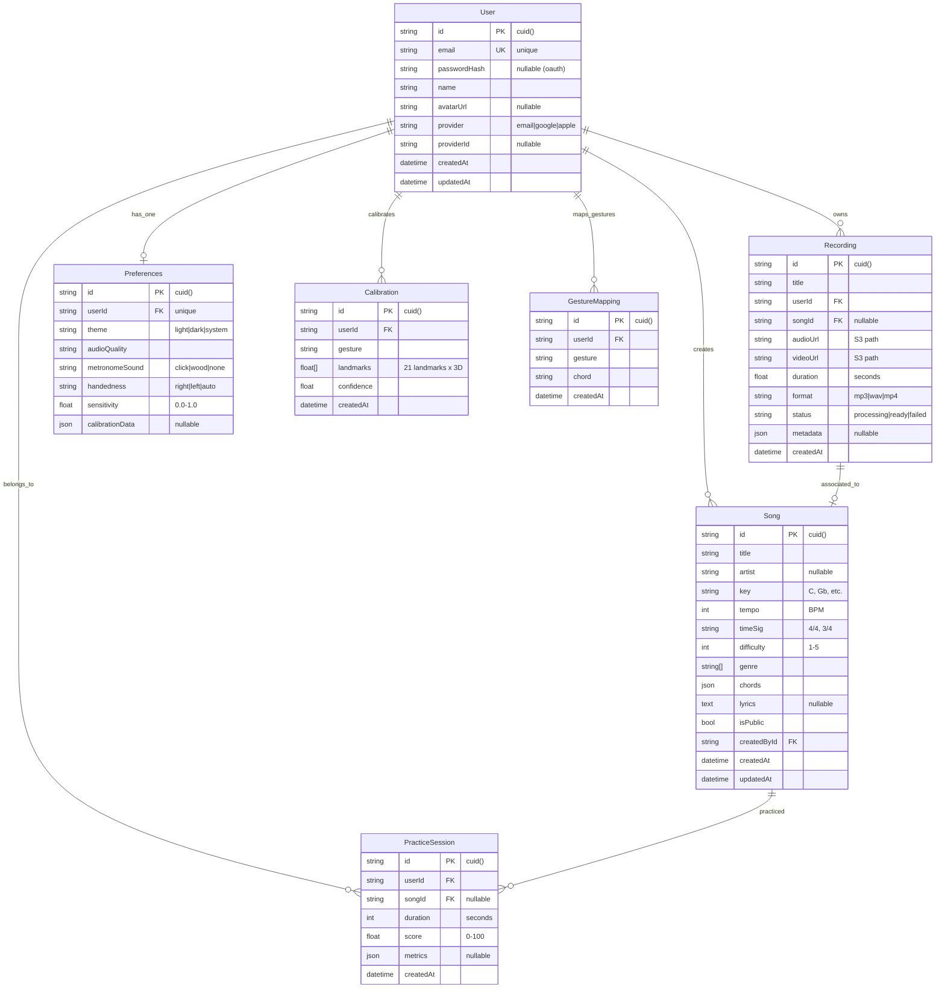

# Database Design

## ER Diagram



---

## Tables (Detailed)

### 1. users

| Column | Type | Constraints | Description |
|--------|------|-------------|-------------|
| id | `varchar(255)` | PK | Unique identifier (cUID) |
| email | `varchar(255)` | UNIQUE, NOT NULL | Login identifier |
| passwordHash | `varchar(255)` | Nullable | bcrypt hash (nullable for OAuth users) |
| name | `varchar(255)` | Nullable | Display name |
| avatarUrl | `varchar(500)` | Nullable | Profile image URL |
| provider | `varchar(20)` | NOT NULL | auth source |
| providerId | `varchar(255)` | Nullable | OAuth subject |
| createdAt | timestamptz | DEFAULT NOW() | |
| updatedAt | timestamptz | DEFAULT NOW() | |

### 2. songs

| Column | Type | Constraints | Description |
|--------|------|-------------|-------------|
| id | `varchar(255)` | PK | |
| title | `varchar(255)` | NOT NULL | |
| artist | `varchar(255)` | Nullable | |
| key | `varchar(10)` | NOT NULL | "C", "F#m", etc. |
| tempo | `int` | NOT NULL, CHECK(between 40 and 300) | BPM |
| timeSig | `varchar(10)` | NOT NULL | "4/4", "3/4", "6/8" |
| difficulty | `int` | CHECK(between 1 and 5) | 1=Easy, 5=Expert |
| genre | `varchar(50)[]` | | Pop, Rock, Jazz, etc. |
| chords | `jsonb` | NOT NULL | Beat-based: `[{beat, chord, duration}]` |
| lyrics | `jsonb` | Nullable | Beat-based: `[{beat, text}]` |
| strumming | `jsonb` | Nullable | Beat-based: `[{beat, pattern, intensity}]` |
| totalBeats | `int` | NOT NULL | Total beats in song |
| isPublic | `boolean` | DEFAULT false | |
| createdById | `varchar(255)` | FK → users.id | |
| createdAt | timestamptz | DEFAULT NOW() | |
| updatedAt | timestamptz | DEFAULT NOW() | |

### 3. recordings

| Column | Type | Constraints | Description |
|--------|------|-------------|-------------|
| id | `varchar(255)` | PK | |
| title | `varchar(255)` | NOT NULL | |
| userId | `varchar(255)` | FK → users.id | |
| songId | `varchar(255)` | FK → songs.id (Nullable) | |
| audioUrl | `varchar(500)` | NOT NULL | S3 path |
| videoUrl | `varchar(500)` | Nullable | |
| duration | `float` | NOT NULL, CHECK(>0) | Seconds |
| format | `varchar(10)` | NOT NULL | "mp3", "wav", "mp4" |
| status | `varchar(20)` | NOT NULL | Status enum |
| metadata | `jsonb` | Nullable | Mix levels, effects, etc. |
| createdAt | timestamptz | DEFAULT NOW() | |

### 4. practice_sessions

| Column | Type | Constraints | Description |
|--------|------|-------------|-------------|
| id | `varchar(255)` | PK | |
| userId | `varchar(255)` | FK → users.id | |
| songId | `varchar(255)` | FK → songs.id (Nullable) | |
| duration | `int` | NOT NULL | Seconds |
| score | `float` | CHECK(0 to 100) | Accuracy + timing |
| metrics | `jsonb` | Nullable | Per-chord accuracy, timing drift |
| createdAt | timestamptz | DEFAULT NOW() | |

### 5. calibrations

| Column | Type | Constraints | Description |
|--------|------|-------------|-------------|
| id | `varchar(255)` | PK | |
| userId | `varchar(255)` | FK → users.id | |
| gesture | `varchar(50)` | NOT NULL | Gesture name |
| landmarks | `float[]` | NOT NULL | Flat array 21×3 |
| confidence | `float` | CHECK(0 to 1) | |
| createdAt | timestamptz | DEFAULT NOW() | |

### 6. gesture_mappings

| Column | Type | Constraints | Description |
|--------|------|-------------|-------------|
| id | `varchar(255)` | PK | |
| userId | `varchar(255)` | FK → users.id | |
| gesture | `varchar(50)` | NOT NULL | |
| chord | `varchar(10)` | NOT NULL | e.g., "Am", "C7" |
| createdAt | timestamptz | DEFAULT NOW() | |

### 7. preferences

| Column | Type | Constraints | Description |
|--------|------|-------------|-------------|
| id | `varchar(255)` | PK | |
| userId | `varchar(255)` | FK → users.id, UNIQUE | |
| theme | `varchar(10)` | DEFAULT "system" | |
| audioQuality | `varchar(10)` | DEFAULT "high" | |
| metronomeSound | `varchar(20)` | DEFAULT "click" | |
| handedness | `varchar(10)` | DEFAULT "right" | |
| sensitivity | `float` | DEFAULT 0.8, CHECK(0 to 1) | |
| calibrationData | `jsonb` | Nullable | Saved calibration records |

### 8. gesture_profiles

| Column | Type | Constraints | Description |
|--------|------|-------------|-------------|
| id | `varchar(255)` | PK | |
| userId | `varchar(255)` | FK → users.id | |
| name | `varchar(50)` | NOT NULL | "Classic", "Worship", "Custom" |
| description | `varchar(255)` | Nullable | |
| genre | `varchar(50)[]` | | Target genres |
| mappings | `jsonb` | NOT NULL | `{gesture: chord}` map |
| isCustom | `boolean` | DEFAULT false | User-created profile |
| createdAt | timestamptz | DEFAULT NOW() | |

### 9. projects (.air files)

| Column | Type | Constraints | Description |
|--------|------|-------------|-------------|
| id | `varchar(255)` | PK | |
| userId | `varchar(255)` | FK → users.id | |
| title | `varchar(255)` | NOT NULL | |
| songId | `varchar(255)` | FK → songs.id, Nullable | Associated song |
| projectData | `jsonb` | NOT NULL | Full .air project JSON |
| duration | `float` | NOT NULL | Seconds |
| fileSize | `int` | NOT NULL | Bytes |
| createdAt | timestamptz | DEFAULT NOW() | |
| updatedAt | timestamptz | DEFAULT NOW() | |

---

## Indexes

| Index | Table | Columns | Purpose |
|-------|-------|---------|---------|
| `idx_user_email` | users | email | FAST login lookup |
| `idx_song_title_search` | songs | title (GIN gin_trgm_ops) | Fuzzy search |
| `idx_song_created_by` | songs | createdById | User's song history |
| `idx_recording_user` | recordings | userId | Quick user recording list |
| `idx_practice_user` | practice_sessions | userId, createdAt | User progress timeline |
| `idx_calibration_user_gesture` | calibrations | userId, gesture | Calibration lookup |
| `idx_gesture_user_gesture` | gesture_mappings | userId, gesture | Custom mapping lookup |

---

## Index Strategy Rationale

- **B-Tree indexes** on foreign keys and equality lookups (user IDs, gesture names)
- **GIN trigram index** (pg_trgm) on `songs.title` for fuzzy/partial search
- **Composite indexes** (`userId` + `createdAt`) for chronological queries
- **No over-indexing**: only indexes that support core query patterns

---

## Caching Strategy

### What to Cache

| Data | Layer | TTL | Invalidation |
|------|-------|-----|--------------|
| Active user session | Redis | 15 min | Token expiry |
| Song details | Redis | 24 hr | Song CRUD events |
| Search results | Redis | 1 hr | New song created |
| Rate limit counters | Redis | 15 min | Window expiry |
| User preferences | Redis | 10 min | Preferences change |

### Cache-Aside Pattern

```typescript
async function getSong(id: string) {
  // 1. Check cache
  const cached = await redis.get(`song:${id}`);
  if (cached) return JSON.parse(cached);
  
  // 2. Query database
  const song = await prisma.song.findUnique({ where: { id } });
  if (!song) throw new NotFoundError();
  
  // 3. Set cache
  await redis.setex(`song:${id}`, 86400, JSON.stringify(song));
  
  return song;
}
```

### Cache Stampede Protection

Use a lock key to prevent cache rebuild stampedes under high concurrency:

```typescript
async function getWithLock(key: string, fetchFn: () => any, ttl: number) {
  const value = await redis.get(key);
  if (value) return JSON.parse(value);
  
  // Try to acquire lock
  const lock = await redis.set(`lock:${key}`, '1', 'EX', 5, 'NX');
  if (lock) {
    try {
      const data = await fetchFn();
      await redis.setex(key, ttl, JSON.stringify(data));
      return data;
    } finally {
      await redis.del(`lock:${key}`);
    }
  }
  
  // Wait and retry if lock acquisition failed
  await new Promise(resolve => setTimeout(resolve, 100));
  return getWithLock(key, fetchFn, ttl);
}
```

---

## Future Scalability

### When PostgreSQL Gets Too Big

| Milestone | Size Threshold | Action |
|-----------|----------------|--------|
| < 1M rows | Current single DB | Add read replicas |
| 1M–100M rows | Growing WAL, slow queries | Table partitions (by createdAt range) |
| 100M+ rows | Query timeouts | Move cold data to data lake (S3 + Athena/Presto) |

### Partitioning Strategy

```sql
-- Partition practice_sessions by month
CREATE TABLE practice_sessions (
    id VARCHAR(255) PRIMARY KEY,
    ...
    created_at TIMESTAMPTZ NOT NULL
) PARTITION BY RANGE (created_at);

CREATE TABLE practice_sessions_2026_07
    PARTITION OF practice_sessions
    FOR VALUES FROM ('2026-07-01') TO ('2026-08-01');
```

### Read Replicas

```
Write Replica (Primary)
    ├── INSERT, UPDATE, DELETE
    
Read Replicas (x3)
    ├── SELECT queries
    ├── Analytics queries
    └── Search queries
```

### Connection Pooling

Use Prisma with connection pooler (PgBouncer) in transaction mode to handle thousands of concurrent connections efficiently.