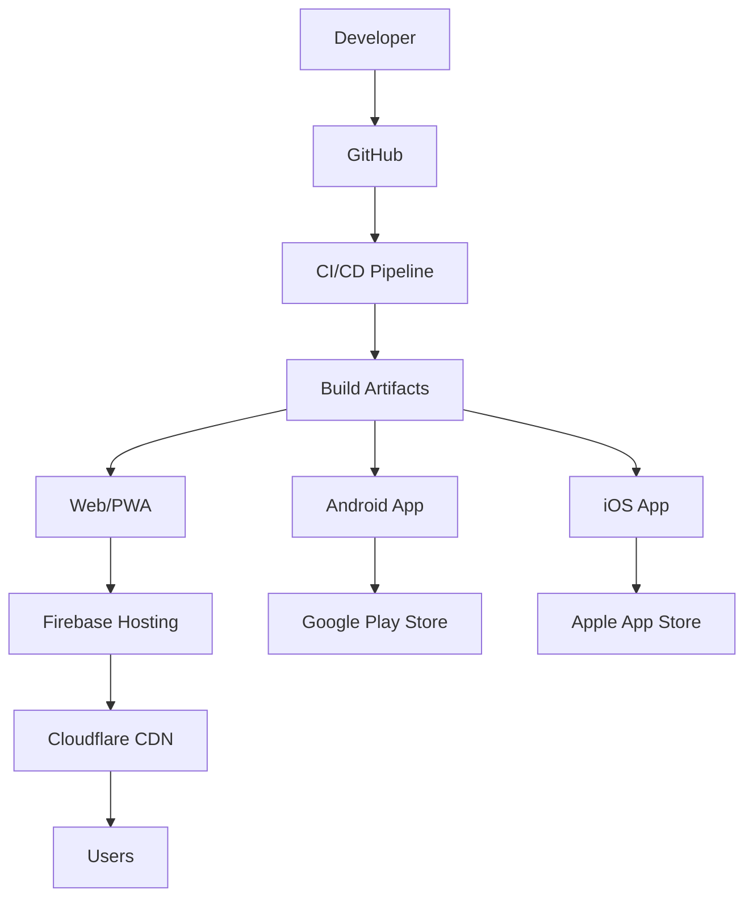
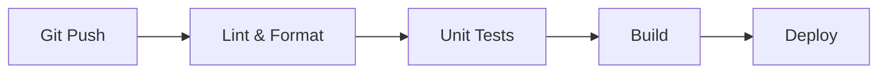

# Deployment Documentation

## 1. Overview

AirChord's deployment architecture supports web (PWA), Android (Play Store), and iOS (App Store) from a single codebase. The CI/CD pipeline automates testing, building, and deployment across all platforms.

---

## 2. Deployment Architecture



---

## 3. Environment Strategy

### 3.1 Environment Tiers

| Environment | Purpose | URL | Database |
|-------------|---------|-----|----------|
| Development | Local development | localhost:3000 | Local Firestore |
| Staging | Pre-production testing | staging.airchord.app | Staging Firestore |
| Production | Live application | airchord.app | Production Firestore |

### 3.2 Environment Variables

| Variable | Dev | Staging | Production |
|----------|-----|---------|------------|
| `VITE_API_URL` | http://localhost:3000 | https://staging-api.airchord.app | https://api.airchord.app |
| `VITE_FIREBASE_CONFIG` | Dev project | Staging project | Production project |
| `VITE_ANALYTICS_ID` | Debug mode | Staging ID | Production ID |

---

## 4. CI/CD Pipeline

### 4.1 Pipeline Stages



### 4.2 GitHub Actions Workflow

```yaml
name: CI/CD Pipeline
on:
  push:
    branches: [main, staging, develop]
  pull_request:
    branches: [main, staging]

jobs:
  lint:
    runs-on: ubuntu-latest
    steps:
      - uses: actions/checkout@v4
      - uses: actions/setup-node@v4
        with: { node-version: '20' }
      - run: npm ci
      - run: npm run lint
      - run: npm run format:check

  test:
    runs-on: ubuntu-latest
    needs: lint
    steps:
      - run: npm run test:unit
      - run: npm run test:integration
      - run: npm run test:coverage
      - uses: codecov/codecov-action@v3

  build:
    runs-on: ubuntu-latest
    needs: test
    steps:
      - run: npm run build
      - uses: actions/upload-artifact@v4
        with:
          name: dist
          path: dist/

  deploy-staging:
    if: github.ref == 'refs/heads/staging'
    needs: build
    runs-on: ubuntu-latest
    steps:
      - uses: FirebaseExtended/action-hosting-deploy@v0
        with:
          repoToken: ${{ secrets.GITHUB_TOKEN }}
          firebaseServiceAccount: ${{ secrets.FIREBASE_SERVICE_ACCOUNT }}
          channelId: staging
          projectId: airchord-staging

  deploy-production:
    if: github.ref == 'refs/heads/main'
    needs: build
    runs-on: ubuntu-latest
    steps:
      - uses: FirebaseExtended/action-hosting-deploy@v0
        with:
          repoToken: ${{ secrets.GITHUB_TOKEN }}
          firebaseServiceAccount: ${{ secrets.FIREBASE_SERVICE_ACCOUNT }}
          channelId: live
          projectId: airchord-production
```

---

## 5. Web Deployment (PWA)

### 5.1 Firebase Hosting

| Setting | Value |
|---------|-------|
| Hosting Provider | Firebase Hosting |
| CDN | Cloudflare (edge caching) |
| SSL | Auto-managed by Firebase |
| Domain | airchord.app |
| Preview Deployments | Automatic per PR |

### 5.2 PWA Configuration

```json
// firebase.json
{
  "hosting": {
    "public": "dist",
    "ignore": ["firebase.json", "**/.*", "**/node_modules/**"],
    "rewrites": [
      { "source": "**", "destination": "/index.html" }
    ],
    "headers": [
      {
        "source": "**/*.@(js|css)",
        "headers": [
          { "key": "Cache-Control", "value": "public, max-age=31536000, immutable" }
        ]
      }
    ]
  }
}
```

### 5.3 Service Worker

```typescript
// vite.config.ts
import { VitePWA } from 'vite-plugin-pwa';

export default {
  plugins: [
    VitePWA({
      registerType: 'autoUpdate',
      includeAssets: ['favicon.ico', 'robots.txt'],
      manifest: {
        name: 'AirChord',
        short_name: 'AirChord',
        theme_color: '#6366F1',
        background_color: '#111827',
        display: 'standalone',
        icons: [
          { src: 'icon-192.png', sizes: '192x192', type: 'image/png' },
          { src: 'icon-512.png', sizes: '512x512', type: 'image/png' }
        ]
      }
    })
  ]
}
```

---

## 6. Android Deployment (Play Store)

### 6.1 Build Process

```bash
# Build Angular app
npm run build

# Add Android platform
npx cap add android

# Sync web assets
npx cap sync

# Build APK/AAB
cd android
./gradlew bundleRelease
```

### 6.2 Play Store Configuration

| Setting | Value |
|---------|-------|
| Package Name | `app.airchord.mobile` |
| Min SDK | 24 (Android 7.0) |
| Target SDK | 34 (Android 14) |
| Version Code | Auto-incremented |
| Version Name | SemVer from package.json |
| Signing | Google Play App Signing |

### 6.3 Store Listing

| Field | Value |
|-------|-------|
| Title | AirChord - Virtual Guitar |
| Short Description | Turn your hand into a live guitar |
| Category | Music & Audio |
| Content Rating | Everyone |
| Privacy Policy | Required |
| Feature Graphic | 1024×500 |
| Screenshots | Phone + Tablet |
| Promo Video | Optional (YouTube link) |

### 6.4 Play Store Release Process

```
1. Update version in package.json
2. Create release branch: git checkout -b release/v1.2.0
3. Build AAB: npm run build:android
4. Upload to Play Console (Internal Testing)
5. Run automated tests
6. Promote to Closed Testing → Open Testing → Production
7. Submit for review
8. Monitor crash reports
```

---

## 7. iOS Deployment (App Store)

### 7.1 Build Process

```bash
# Build Angular app
npm run build

# Add iOS platform
npx cap add ios

# Sync web assets
npx cap sync

# Open Xcode
npx cap open ios
```

### 7.2 App Store Configuration

| Setting | Value |
|---------|-------|
| Bundle ID | `app.airchord.mobile` |
| Minimum iOS | 15.0 |
| Target iOS | 17.0 |
| Version | SemVer from package.json |
| Build Number | Auto-incremented |
| Signing | Automatic (Xcode Managed) |

### 7.3 Required Permissions

```xml
<!-- Info.plist -->
<key>NSCameraUsageDescription</key>
<string>AirChord needs camera access for hand gesture recognition</string>
<key>NSMicrophoneUsageDescription</key>
<string>AirChord needs microphone access for voice recording</string>
```

### 7.4 App Store Review Guidelines

| Guideline | Compliance |
|-----------|------------|
| 2.5.1 | Uses public APIs only |
| 3.1.1 | In-app purchase via Apple IAP |
| 5.1.1 | Privacy policy link |
| 5.1.2 | Data collection disclosure |

---

## 8. Capacitor Configuration

### 8.1 capacitor.config.ts

```typescript
import { CapacitorConfig } from '@capacitor/cli';

const config: CapacitorConfig = {
  appId: 'app.airchord.mobile',
  appName: 'AirChord',
  webDir: 'dist',
  server: {
    androidScheme: 'https',
    url: 'http://localhost:3000', // Dev only
    cleartext: true
  },
  plugins: {
    Camera: {
      permissions: ['camera', 'microphone']
    }
  }
};

export default config;
```

---

## 9. Monitoring & Observability

### 9.1 Production Monitoring Stack

| Tool | Purpose | Free Tier |
|------|---------|-----------|
| Firebase Crashlytics | Crash reporting | Yes |
| Firebase Performance | App performance | Yes |
| Sentry | Error tracking | 5K events/mo |
| LogRocket | Session replay | 1K sessions/mo |
| PostHog | Analytics | 1M events/mo |

### 9.2 Key Metrics Dashboard

| Metric | Target | Alert |
|--------|--------|-------|
| Crash-Free Sessions | >99.5% | <99% |
| ANR Rate (Android) | <0.5% | >1% |
| App Start Time | <2s | >3s |
| API Response Time | <200ms P95 | >500ms |
| Uptime | 99.9% | <99.5% |

### 9.3 Alerting Rules

| Condition | Severity | Channel |
|-----------|----------|---------|
| Crash rate >1% | Critical | PagerDuty + Slack |
| Error rate >5% | High | Slack |
| P95 latency >500ms | Medium | Slack |
| Deploy failure | High | Slack |

---

## 10. Rollback Strategy

### 10.1 Web Rollback

```bash
# Firebase Hosting - instant rollback
firebase hosting:channel:rollback live
```

### 10.2 Mobile Rollback

| Platform | Method | Time |
|----------|--------|------|
| Android | Play Console → Rollback release | 1-24 hours |
| iOS | App Store → Remove version | 24-48 hours |

### 10.3 Feature Flags

```typescript
// LaunchDarkly / Firebase Remote Config
const features = {
  newGestureEngine: false,
  aiCoach: false,
  premiumFeatures: false,
};

// Gradual rollout
if (features.newGestureEngine) {
  // New code path
} else {
  // Legacy code path
}
```

---

## 11. Release Process

### 11.1 Version Management

| Version | Meaning | Example |
|---------|---------|---------|
| Major | Breaking changes | 2.0.0 |
| Minor | New features | 1.2.0 |
| Patch | Bug fixes | 1.2.3 |

### 11.2 Release Checklist

- [ ] All tests passing
- [ ] Code review approved
- [ ] QA testing complete
- [ ] Performance benchmarks met
- [ ] Security scan clean
- [ ] Documentation updated
- [ ] Changelog written
- [ ] Store listing updated
- [ ] Screenshots current
- [ ] Privacy policy updated
- [ ] Support team notified
