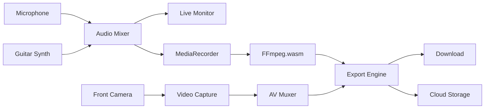

# Recording Studio Documentation

## 1. Overview

AirChord's Recording Studio allows users to capture their vocal and guitar performances, mix tracks, apply effects, and export high-quality audio/video files. The studio supports multi-track recording, real-time monitoring, and professional-grade export formats.

---

## 2. Recording Architecture



---

## 3. Voice Recording

### 3.1 Microphone Setup

```typescript
interface MicConfig {
  echoCancellation: true;
  noiseSuppression: true;
  autoGainControl: true;
  sampleRate: 48000;
  channelCount: 2; // Stereo
}
```

### 3.2 Audio Capture Pipeline

```
Microphone → MediaStream → AudioContext MediaStreamSource
    ↓
AnalyserNode (for visualization)
    ↓
MediaRecorder (audio/webm;codecs=opus)
    ↓
Chunks → Web Worker → Buffer
```

### 3.3 Voice Quality Settings

| Quality | Sample Rate | Bitrate | File Size (1 min) |
|---------|-------------|---------|-------------------|
| Low | 22.05 kHz | 64 kbps | ~500 KB |
| Medium | 44.1 kHz | 128 kbps | ~1 MB |
| High | 48 kHz | 192 kbps | ~1.5 MB |
| Studio | 48 kHz | 320 kbps | ~2.5 MB |

---

## 4. Camera Recording

### 4.1 Video Capture

```typescript
interface VideoConfig {
  width: 1920;
  height: 1080;
  frameRate: 30;
  facingMode: 'user'; // Front camera for selfie performance
}
```

### 4.2 Video Quality Settings

| Quality | Resolution | Frame Rate | Bitrate |
|---------|------------|------------|---------|
| Social | 720p | 30 fps | 2.5 Mbps |
| Standard | 1080p | 30 fps | 5 Mbps |
| High | 1080p | 60 fps | 10 Mbps |
| 4K (Future) | 4K | 30 fps | 20 Mbps |

### 4.3 Camera Overlay

During video recording, the following overlays are composited:
- Hand landmark visualization (optional)
- Chord display (current chord)
- Lyrics display (if enabled)
- Metronome visual (if enabled)
- Recording timer

---

## 5. Audio Synchronization

### 5.1 Sync Strategy

```
Audio Track:  [====Guitar====][====Voice====]
Video Track:  [===========Camera Feed===========]
              ↑                                    ↑
         Start (same timestamp)            Stop (same timestamp)
```

### 5.2 Sync Accuracy

| Metric | Target | Max Allowed |
|--------|--------|-------------|
| Audio-Video Drift | <5ms | <10ms |
| Audio-Audio Drift | <2ms | <5ms |
| Start Sync | 0ms | <16ms (1 frame) |

### 5.3 Clock Source

```typescript
// Use AudioContext clock as master (most stable)
const startTime = audioContext.currentTime;
// ... recording ...
const duration = audioContext.currentTime - startTime;
```

---

## 6. Multi-Track Recording

### 6.1 Track Layout

| Track | Source | Default Level |
|-------|--------|---------------|
| Track 1 | Guitar Synth | 70% |
| Track 2 | Microphone | 60% |
| Track 3 | Metronome (optional) | 40% |
| Track 4 | Backing Track (future) | 50% |

### 6.2 Track Controls

| Control | Range | Description |
|---------|-------|-------------|
| Volume | 0-100% | Individual track level |
| Pan | L100-R100 | Stereo positioning |
| Mute | On/Off | Silence track |
| Solo | On/Off | Listen to track alone |
| Record Arm | On/Off | Enable recording |
| Effects | Per-track | Apply effects chain |

---

## 7. Mixing

### 7.1 Real-Time Mixer

```
Track 1 ─[Vol]─[Pan]─[Mute]─┐
Track 2 ─[Vol]─[Pan]─[Mute]─┤
Track 3 ─[Vol]─[Pan]─[Mute]─┼─→ Master Bus → Compressor → Limiter → Output
Track 4 ─[Vol]─[Pan]─[Mute]─┘
```

### 7.2 Mixing Controls

| Parameter | Range | Default |
|-----------|-------|---------|
| Track Volume | 0-100% | 70% |
| Master Volume | 0-100% | 80% |
| Pan | -100 to +100 | 0 (Center) |
| EQ Low | -12 to +12 dB | 0 dB |
| EQ Mid | -12 to +12 dB | 0 dB |
| EQ High | -12 to +12 dB | 0 dB |

### 7.3 Auto-Mix

The AI auto-mix feature (Phase 7) analyzes recording levels and suggests optimal mix settings.

---

## 8. Noise Reduction

### 8.1 Built-in Processing

| Technique | Implementation | CPU Cost |
|-----------|---------------|----------|
| Noise Gate | Silence below threshold | Low |
| Noise Suppression | WebRTC NS module | Medium |
| De-esser | Sibilance reduction | Medium |
| Room Tone | Ambient noise profile | Low |

### 8.2 Noise Reduction Settings

| Setting | Range | Effect |
|---------|-------|--------|
| Strength | 0-100% | Amount of noise removal |
| Threshold | -60 to -20 dB | Gate cutoff level |
| Attack | 1-50 ms | How fast gate opens |
| Release | 50-500 ms | How fast gate closes |

---

## 9. Export

### 9.1 Export Options

| Format | Use Case | Quality | Includes Video |
|--------|----------|---------|----------------|
| MP3 128 | Quick share | Standard | No |
| MP3 320 | High quality share | High | No |
| WAV 48k | DAW import | Lossless | No |
| M4A | Apple ecosystem | High | No |
| MP4 720p | Social media | Standard | Yes |
| MP4 1080p | YouTube upload | High | Yes |
| MP4 4K | Professional | Ultra | Yes |

### 9.2 Export Pipeline

```
Recording Complete → User Selects Format
    ↓
FFmpeg.wasm Processing:
    1. Decode source tracks
    2. Apply mixing settings
    3. Apply effects
    4. Normalize audio levels
    5. Encode to target format
    6. Mux audio+video (if MP4)
    ↓
Generate Blob → Download to Device
    ↓
(Optional) Upload to Cloud Storage
```

### 9.3 Platform-Specific Limits

| Platform | Max File Size | Max Resolution | Recommended Format |
|----------|---------------|----------------|-------------------|
| Instagram | 650 MB | 1080p | MP4 (H.264) |
| TikTok | 287 MB | 1080p | MP4 (H.264) |
| YouTube | 128 GB | 4K | MP4 (H.264/H.265) |
| WhatsApp | 16 MB | 720p | MP4 |
| Twitter | 512 MB | 1080p | MP4 |

---

## 10. Project Save/Load (.air Format)

### 10.1 Project File Structure

AirChord saves re-editable projects as `.air` files. These contain everything needed to reopen and edit a performance.

```json
{
  "format": "airchord-project",
  "version": "1.0",
  "createdAt": "2026-07-25T10:00:00Z",
  "updatedAt": "2026-07-25T10:15:00Z",

  "song": {
    "title": "Let It Be",
    "key": "C",
    "tempo": 72,
    "timeSignature": [4, 4],
    "chords": [
      { "beat": 0, "chord": "C", "duration": 4 },
      { "beat": 4, "chord": "G", "duration": 4 },
      { "beat": 8, "chord": "Am", "duration": 4 },
      { "beat": 12, "chord": "F", "duration": 4 }
    ]
  },

  "tracks": [
    {
      "id": "track_1",
      "name": "Voice",
      "type": "audio",
      "source": "microphone",
      "volume": 0.7,
      "pan": 0,
      "effects": [],
      "audioUrl": "local://track_voice.wav"
    },
    {
      "id": "track_2",
      "name": "Guitar",
      "type": "audio",
      "source": "guitar-synth",
      "volume": 0.6,
      "pan": -10,
      "effects": ["reverb"],
      "audioUrl": "local://track_guitar.wav"
    }
  ],

  "video": {
    "enabled": true,
    "camera": "front",
    "resolution": "1080p",
    "videoUrl": "local://video.mp4"
  },

  "gestureConfig": {
    "profile": "Classic",
    "customMappings": {},
    "calibrationData": null
  },

  "performanceSettings": {
    "capo": 0,
    "strumPattern": "folk",
    "metronomeEnabled": false,
    "dynamicBandEnabled": true,
    "dynamicSensitivity": 0.5
  },

  "mixSettings": {
    "masterVolume": 0.8,
    "balance": {
      "voice": 0.7,
      "guitar": 0.6,
      "metronome": 0.0
    }
  },

  "metadata": {
    "duration": 180,
    "totalBeats": 48,
    "recordingDate": "2026-07-25T10:00:00Z",
    "device": "iPhone 15 Pro",
    "appVersion": "1.0.0"
  }
}
```

### 10.2 .air File Benefits

| Benefit | Description |
|---------|-------------|
| Re-editable | Open and change any setting later |
| Portable | Transfer between devices |
| Version control | Save multiple versions of same song |
| Non-destructive | Original audio preserved |
| Full context | All settings preserved (capo, tempo, profile, etc.) |

### 10.2 Save Locations

| Location | Sync | Capacity |
|----------|------|----------|
| Local (IndexedDB) | No | Device storage |
| Cloud (Firebase) | Yes | Unlimited (paid) |
| Export Project File | No | Manual backup |

---

## 11. Sharing

### 11.1 Share Targets

| Target | Method | Format |
|--------|--------|--------|
| Save to Device | Download | Any |
| Instagram | Share Sheet | MP4 (1080p) |
| TikTok | Share Sheet | MP4 (1080p) |
| YouTube | Share Sheet | MP4 (1080p) |
| WhatsApp | Share Sheet | MP4 (720p) |
| Email | Mail compose | MP3/MP4 |
| Clipboard | Copy link | Cloud URL (future) |

### 11.2 Share Flow

```
Recording Complete → Share Button → Platform Selection
    ↓
Auto-optimize for platform:
    - Resize video
    - Adjust bitrate
    - Trim to platform limits
    ↓
Native Share API / Direct Export
```

---

## 12. Performance Considerations

| Concern | Solution |
|---------|----------|
| Large file processing | Web Worker + FFmpeg.wasm |
| Memory usage | Stream processing, not full-file load |
| Battery drain | Reduce frame rate during recording |
| Storage space | Show available space before recording |
| Background recording | Use Service Worker for continued capture |
