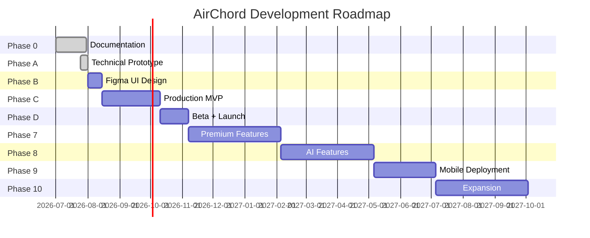

# Complete Development Roadmap

## 1. Overview

AirChord's development follows a prototype-first approach: prove the core interaction works before designing the UI. Each phase builds on the previous, delivering incremental value.

---

## 2. Current Status

| Phase | What | Status |
|-------|------|--------|
| **Phase 0** | Documentation | ✅ Complete (8,340+ lines) |
| **Phase A** | Technical Prototype | ✅ Complete (Camera → Gesture → Sound) |
| **Phase B** | Figma UI Design | ⏳ Next |
| **Phase C** | Production MVP | Planned |
| **Phase D** | Beta + Launch | Planned |

---

## 3. Roadmap Timeline



---

## 4. Phase 0: Documentation ✅ COMPLETE

**Duration**: Weeks 1-4 (Completed)
**Status**: ✅ All 20 documents generated (8,340+ lines)

| Deliverable | Status |
|-------------|--------|
| PRD | ✅ Complete |
| SRS | ✅ Complete |
| Feature List | ✅ Complete |
| User Flow | ✅ Complete |
| UI/UX Design | ✅ Complete |
| Architecture | ✅ Complete |
| Frontend Docs | ✅ Complete |
| Backend Docs | ✅ Complete |
| Database Design | ✅ Complete |
| API Documentation | ✅ Complete |
| Gesture Recognition | ✅ Complete |
| Audio Engine | ✅ Complete |
| Recording Studio | ✅ Complete |
| Practice Mode | ✅ Complete |
| AI Features | ✅ Complete |
| Security | ✅ Complete |
| Testing | ✅ Complete |
| Deployment | ✅ Complete |
| Roadmap | ✅ Complete |
| Folder Structure | ✅ Complete |

---

## 5. Phase A: Technical Prototype ✅ COMPLETE

**Duration**: 1 week (Completed)
**Status**: ✅ Core interaction loop working

### What Was Built

| Feature | Status |
|---------|--------|
| Camera hand tracking | ✅ Working |
| MediaPipe integration | ✅ Working |
| Finger counting (0-5) | ✅ Working |
| Gesture → Chord mapping | ✅ Working |
| Guitar audio synthesis | ✅ Working |
| Gesture profiles | ✅ 4 profiles (Classic, Worship, Bollywood, Blues) |
| Calibration screen | ✅ Working |
| Debug panel | ✅ FPS, latency, hand status |
| Hand landmark overlay | ✅ Visual feedback |
| Low light warning | ✅ Working |

### Architecture

```
prototype/src/
├── camera/          # Camera feed + MediaPipe Tasks Vision
├── gesture/         # Gesture engine + profiles
├── audio/           # Karplus-Strong guitar synthesis
├── ui/              # DebugPanel, ChordDisplay, ProfileSelector, etc.
└── utils/           # Latency profiler
```

### Success Criteria Met

| Criterion | Result |
|-----------|--------|
| Camera stable | ✅ 30+ FPS |
| Finger detection reliable | ✅ 0-5 fingers detected |
| Chord changes instantly | ✅ <100ms perceived latency |
| Audio sounds like guitar | ✅ Karplus-Strong synthesis |
| Feels like playing music | ✅ Core interaction works |

### Known Limitations

- Thumb detection requires natural hand position
- Low light affects accuracy
- Single hand only (no two-hand chords yet)
- No strumming patterns yet
- No recording yet

---

## 6. Phase B: Figma UI Design (Next)

**Duration**: 2 weeks
**Goal**: Design all screens based on prototype learnings

**Duration**: Weeks 5-6
**Goal**: Finalize all visual designs and design system

### Deliverables

| Deliverable | Description | Owner |
|-------------|-------------|-------|
| Design System | Component library in Figma | Designer |
| Wireframes | All screens low-fidelity | Designer |
| Mockups | All screens high-fidelity | Designer |
| Prototype | Interactive Figma prototype | Designer |
| Icon Set | Custom icon library | Designer |
| Animation Specs | Micro-interaction definitions | Designer |
| 3D Specs | Landing page 3D guitar model specs | 3D Artist |
| Song Timeline UI | Timeline component design | Designer |

### Design System Components

| Category | Components |
|----------|------------|
| **Buttons** | Primary, Secondary, Ghost, Icon, FAB |
| **Cards** | Song Card, Chord Card, Session Card, Achievement |
| **Inputs** | Text, Slider, Toggle, Dropdown, Search |
| **Feedback** | Toast, Alert, Progress Bar, Skeleton |
| **Navigation** | Header, Sidebar, Bottom Nav, Tabs |
| **Overlays** | Modal, Bottom Sheet, Drawer, Tooltip |
| **Data** | Chart, Timeline, Heatmap, Sparkline |
| **Special** | Chord Diagram, Hand Overlay, Waveform |

### Animation Specifications

| Animation | Duration | Easing | Trigger |
|-----------|----------|--------|---------|
| Chord change pulse | 200ms | ease-out | Gesture detected |
| Strum wave ripple | 150ms | cubic-bezier(0.4,0,0.2,1) | Strum triggered |
| Page transition | 300ms | ease-in-out | Route change |
| Button press | 100ms | ease-out | Tap |
| Card appear | 250ms | spring(1, 80, 10) | List load |
| Error shake | 400ms | linear | Validation fail |
| Success checkmark | 500ms | ease-out | Action complete |
| Loading spinner | 1000ms | linear | Async operation |
| 3D guitar idle | 3000ms | sine-in-out | Landing page |
| Timeline scroll | 150ms | ease-out | Beat advance |

### Key Screens

1. Splash Screen
2. Onboarding (3 screens)
3. Home Dashboard
4. Free Play Mode
5. Practice Mode
6. Recording Studio
7. Song Library
8. Song Detail
9. Settings
10. Profile
11. Help
12. Subscription (future)

### Exit Criteria

- [ ] All screens designed in Figma
- [ ] Design system documented
- [ ] Prototype tested with 5 users
- [ ] Accessibility review complete
- [ ] Stakeholder approval

---

## 5. Phase 3: Prototype

**Duration**: Weeks 7-10
**Goal**: Build clickable prototype with core gesture-to-audio pipeline

### Deliverables

| Deliverable | Description | Priority |
|-------------|-------------|----------|
| Camera Integration | MediaPipe hand tracking | P0 |
| Gesture Classification | 12 chord gestures | P0 |
| Audio Synthesis | Guitar chord playback | P0 |
| Basic UI | Core screens implemented | P0 |
| Strumming Patterns | 4 basic patterns | P1 |
| Metronome | Visual + audio | P1 |
| Tempo Control | BPM slider | P1 |

### Technical Milestones

| Week | Milestone |
|------|-----------|
| 7 | Camera + MediaPipe working |
| 8 | Gesture → Chord mapping functional |
| 9 | Audio synthesis producing sound |
| 10 | End-to-end demo ready |

### Exit Criteria

- [ ] Hand gesture triggers chord sound
- [ ] Latency <100ms (prototype target)
- [ ] 12 chords working
- [ ] Basic UI functional
- [ ] Demo video recorded

---

## 6. Phase 4: MVP

**Duration**: Weeks 11-14
**Goal**: Complete minimum viable product for web

### Features

| Feature | Status | Priority |
|---------|--------|----------|
| Camera hand tracking | ✅ From prototype | P0 |
| 12 chord gestures | ✅ From prototype | P0 |
| Guitar synthesis | ✅ From prototype | P0 |
| Strumming patterns (8) | New | P0 |
| Metronome | ✅ From prototype | P0 |
| Tempo control (40-240 BPM) | New | P0 |
| Capo (0-12 frets) | New | P0 |
| Recording (audio) | New | P0 |
| MP3 export | New | P0 |
| Song library (local) | New | P0 |
| Practice mode (basic) | New | P1 |
| Dark/light theme | New | P1 |
| Offline support | New | P1 |
| Responsive design | New | P1 |

### Technical Requirements

| Metric | Target |
|--------|--------|
| Gesture Accuracy | >90% |
| Audio Latency | <50ms |
| Lighthouse Score | >90 |
| Test Coverage | >80% |
| Bundle Size | <500KB |

### Exit Criteria

- [ ] All MVP features working
- [ ] Performance targets met
- [ ] Cross-browser tested
- [ ] Accessibility audit passed
- [ ] Security review complete

---

## 7. Phase 5: Beta

**Duration**: Weeks 15-18
**Goal**: Closed beta with 100-500 users

### Activities

| Activity | Timeline |
|----------|----------|
| Beta recruitment | Week 15 |
| Beta launch | Week 16 |
| Feedback collection | Weeks 16-18 |
| Bug fixes | Weeks 16-18 |
| Performance optimization | Week 17 |
| Final polish | Week 18 |

### Beta Metrics

| Metric | Target |
|--------|--------|
| Beta signups | 500 |
| Daily active testers | 100 |
| Session duration | >5 min |
| Crash-free sessions | >99% |
| NPS score | >30 |

### Exit Criteria

- [ ] <10 critical bugs
- [ ] Performance targets met
- [ ] User feedback incorporated
- [ ] Store listing ready
- [ ] Marketing materials ready

---

## 8. Phase 6: Public Launch 🚀

**Duration**: Week 19
**Goal**: Public web launch (PWA)

### Launch Activities

| Activity | Timeline |
|----------|----------|
| Production deploy | Day 1 |
| Press release | Day 1 |
| Social media launch | Day 1 |
| Product Hunt launch | Day 2 |
| Monitor metrics | Days 1-7 |
| Hotfixes if needed | As needed |

### Launch Metrics

| Metric | Week 1 Target |
|--------|---------------|
| Signups | 1,000 |
| DAU | 200 |
| Session duration | >5 min |
| Retention (Day 7) | >30% |
| Crash rate | <1% |

---

## 9. Phase 7: Premium Features

**Duration**: Months 4-6
**Goal**: Monetization and advanced features

### Features

| Feature | Description | Priority |
|---------|-------------|----------|
| Premium subscription | Monthly/annual plans | P0 |
| Advanced instruments | Electric guitar, bass, ukulele | P1 |
| Advanced effects | Reverb, delay, distortion | P1 |
| Recording studio | Multi-track recording | P1 |
| WAV export | Lossless audio export | P1 |
| MP4 export | Video recording export | P1 |
| Cloud sync | Cross-device sync | P1 |
| Custom chord presets | User-created chords | P2 |
| Song import | Import chord charts | P2 |

### Monetization

| Tier | Price | Features |
|------|-------|----------|
| Free | $0 | Basic chords, 3 patterns, MP3 export |
| Pro | $9.99/mo | All instruments, effects, WAV/MP4, cloud |
| Studio | $19.99/mo | Everything + priority support |

---

## 10. Phase 8: AI Features

**Duration**: Months 7-9
**Goal**: Intelligent practice and assistance

### Features

| Feature | Description | Priority |
|---------|-------------|----------|
| AI Practice Coach | Real-time feedback | P0 |
| Chord Prediction | Next chord suggestion | P1 |
| Key Detection | Auto-detect song key | P1 |
| Capo Recommendation | Smart capo suggestion | P1 |
| Difficulty Estimation | Song difficulty scoring | P2 |
| Mistake Detection | Error pattern analysis | P2 |
| Song Transcription | Audio → chord chart | P3 |
| Voice Assistant | "Play C chord" commands | P3 |

---

## 11. Phase 9: Mobile Deployment

**Duration**: Months 10-12
**Goal**: Native mobile apps

### Activities

| Activity | Platform | Timeline |
|----------|----------|----------|
| Capacitor integration | Both | Month 10 |
| Android optimization | Android | Month 11 |
| iOS optimization | iOS | Month 11 |
| Play Store submission | Android | Month 12 |
| App Store submission | iOS | Month 12 |

### Store Requirements

| Requirement | Android | iOS |
|-------------|---------|-----|
| Min SDK | 24 (7.0) | 15.0 |
| Target SDK | 34 (14.0) | 17.0 |
| Privacy Policy | Required | Required |
| Screenshots | 2-8 | 3-10 |
| Feature Graphic | 1024×500 | 1024×500 |
| App Icon | 512×512 | 1024×1024 |

---

## 12. Phase 10: Expansion

**Duration**: Year 2
**Goal**: Platform expansion and ecosystem

### Features

| Feature | Description | Timeline |
|---------|-------------|----------|
| Multi-instrument | Drums, piano, strings | Q1 |
| Live performance mode | Real-time streaming | Q1 |
| Collaboration | Multi-user jam sessions | Q2 |
| Plugin marketplace | Third-party extensions | Q2 |
| Apple Watch | Gesture input | Q3 |
| Desktop app | Electron/Tauri | Q3 |
| API for developers | Public API | Q4 |

---

## 13. Success Milestones

| Milestone | Target Date | Metric |
|-----------|-------------|--------|
| Documentation Complete | Month 1 | ✅ Done |
| First Working Prototype | Month 3 | Gesture → Sound |
| MVP Launch | Month 5 | 1,000 users |
| Public Launch | Month 5 | 5,000 users |
| 10K Users | Month 7 | MAU |
| 50K Users | Month 12 | MAU |
| 100K Users | Month 18 | MAU |
| Revenue Target | Month 12 | $10K MRR |
| Play Store Launch | Month 12 | 4.0+ rating |
| App Store Launch | Month 12 | 4.0+ rating |

---

## 14. Risk Assessment

| Risk | Probability | Impact | Mitigation |
|------|-------------|--------|------------|
| Gesture accuracy insufficient | Medium | High | Extensive testing, calibration |
| Audio latency too high | Low | High | Web Worker optimization |
| Low user adoption | Medium | High | Marketing, influencer partnerships |
| Apple review rejection | Low | Medium | Follow guidelines strictly |
| Competitor launches similar | Medium | Medium | Fast iteration, unique features |
| Team burnout | Medium | Medium | Sustainable pace, breaks |

---

## 15. Team Requirements

| Role | Phase 3+ | Phase 6+ | Phase 9+ |
|------|----------|----------|----------|
| Frontend Engineer | 1 | 2 | 3 |
| Backend Engineer | 1 | 1 | 2 |
| UI/UX Designer | 1 | 1 | 1 |
| QA Engineer | 0 | 1 | 1 |
| Product Manager | 0 | 1 | 1 |
| DevOps | 0 | 0.5 | 1 |
| Marketing | 0 | 1 | 2 |
| **Total** | **3** | **6.5** | **11** |
