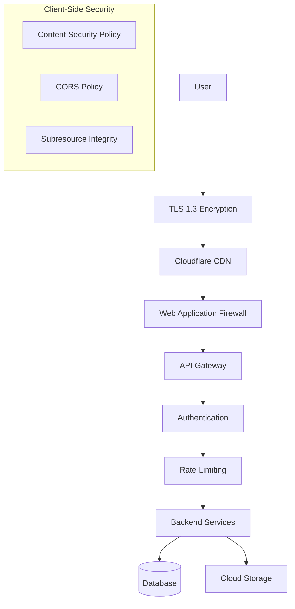

# Security Documentation

## 1. Overview

AirChord implements a comprehensive security architecture protecting user data, audio content, camera/microphone access, and cloud infrastructure. The security model follows defense-in-depth principles with multiple layers of protection.

---

## 2. Security Architecture



---

## 3. Authentication

### 3.1 Authentication Methods

| Method | Implementation | Security Level |
|--------|---------------|----------------|
| Email/Password | Firebase Auth + bcrypt | Standard |
| Google OAuth 2.0 | Firebase Auth | High |
| Apple Sign In | Firebase Auth | High |
| Biometric (Future) | WebAuthn / Passkeys | Very High |

### 3.2 Password Policy

| Requirement | Rule |
|-------------|------|
| Minimum Length | 8 characters |
| Complexity | Uppercase + lowercase + number |
| Maximum Length | 128 characters |
| Hashing | bcrypt (12 rounds) |
| Salt | Auto-generated per password |
| Breach Check | Have I Been Pwned API |

### 3.3 Token Management

```typescript
interface TokenConfig {
  accessToken: {
    expiresIn: '15m',
    algorithm: 'RS256',
    claims: ['userId', 'email', 'role']
  };
  refreshToken: {
    expiresIn: '7d',
    algorithm: 'RS256',
    claims: ['userId', 'tokenFamily']
  };
}
```

### 3.4 Token Refresh Flow

```
Access Token Expires (15 min)
    ↓
Client Detects 401 Response
    ↓
Send Refresh Token to /auth/refresh
    ↓
Backend Validates Refresh Token
    ↓
Issue New Access Token + Refresh Token
    ↓
Old Refresh Token Invalidated (rotation)
```

### 3.5 Session Management

| Feature | Implementation |
|---------|---------------|
| Concurrent Sessions | Max 5 devices |
| Session Timeout | 30 days (refresh token) |
| Session Revocation | User can revoke all sessions |
| Anomaly Detection | Unusual location/device alerts |

---

## 4. Encryption

### 4.1 Transport Encryption

| Layer | Protocol | Configuration |
|-------|----------|---------------|
| HTTPS | TLS 1.3 | Minimum version |
| HSTS | Strict | max-age=31536000; includeSubDomains |
| Certificate | EV SSL | Extended Validation |
| HPKP | Disabled | Deprecated, using CT logs |

### 4.2 Data at Rest

| Data Type | Encryption | Key Management |
|-----------|------------|----------------|
| User Data | AES-256 | Firebase KMS |
| Audio Files | AES-256 | S3 SSE-S3 |
| Database | AES-256 | Provider-managed |
| Backups | AES-256 | Separate keys |

### 4.3 Field-Level Encryption

| Field | Encryption | Purpose |
|-------|------------|---------|
| Email | AES-256-GCM | PII protection |
| Password | bcrypt | One-way hash |
| Payment Info | Stripe tokenization | PCI compliance |
| Calibration Data | AES-256 | Biometric-like data |

---

## 5. Privacy

### 5.1 Data Collection

| Data Type | Collected | Purpose | Retention |
|-----------|-----------|---------|-----------|
| Camera Feed | No (processed locally) | Gesture recognition | Not stored |
| Microphone | No (processed locally) | Voice recording | User-initiated only |
| Hand Landmarks | Optional (calibration) | Gesture improvement | User-controlled |
| Usage Analytics | Yes (anonymous) | App improvement | 12 months |
| Recording Files | User-initiated | Cloud backup | User-controlled |

### 5.2 Privacy Principles

1. **Camera/Microphone**: Never transmitted to servers
2. **Local Processing**: All gesture recognition runs client-side
3. **Opt-in Only**: Cloud sync requires explicit consent
4. **Data Minimization**: Collect only what's necessary
5. **Right to Delete**: Users can delete all data anytime
6. **Transparency**: Clear privacy policy

### 5.3 GDPR Compliance

| Right | Implementation |
|-------|---------------|
| Right to Access | Data export feature |
| Right to Rectification | Profile editing |
| Right to Erasure | Account deletion |
| Right to Portability | JSON/CSV export |
| Right to Object | Opt-out of analytics |
| Data Protection Officer | Contact: privacy@airchord.app |

### 5.4 CCPA Compliance

| Requirement | Implementation |
|-------------|---------------|
| Notice at Collection | Privacy policy link at signup |
| Right to Know | Data access request form |
| Right to Delete | Account deletion in settings |
| Right to Opt-Out | Do Not Sell My Data toggle |
| Non-Discrimination | No service degradation for opt-out |

---

## 6. Camera Permissions

### 6.1 Permission Request

```typescript
// Request camera with explanation
const stream = await navigator.mediaDevices.getUserMedia({
  video: {
    facingMode: 'user',
    width: { ideal: 1280 },
    height: { ideal: 720 }
  }
});
```

### 6.2 Permission Handling

| State | UI Response |
|-------|-------------|
| Granted | Normal operation |
| Denied | Show help modal with instructions |
| Prompt | Explain why camera is needed |
| Not Available | Show unsupported device message |

### 6.3 Camera Privacy

- Camera feed never leaves the device
- No server-side processing
- No image/video storage (unless user records)
- Permission can be revoked anytime
- Visual indicator when camera is active

---

## 7. Microphone Permissions

### 7.1 Permission Request

```typescript
const stream = await navigator.mediaDevices.getUserMedia({
  audio: {
    echoCancellation: true,
    noiseSuppression: true,
    autoGainControl: true
  }
});
```

### 7.2 Microphone Privacy

- Audio processed locally via Web Audio API
- No server-side audio processing
- Recording requires explicit user action
- Permission can be revoked anytime
- Visual indicator during recording

---

## 8. Cloud Security

### 8.1 Firebase Security Rules

```javascript
// Firestore Security Rules
rules_version = '2';
service cloud.firestore {
  match /databases/{database}/documents {
    // Users can only read/write their own data
    match /users/{userId} {
      allow read, write: if request.auth != null && request.auth.uid == userId;
    }
    
    // Songs: public read, owner write
    match /songs/{songId} {
      allow read: if true;
      allow write: if request.auth != null && 
        resource.data.createdById == request.auth.uid;
    }
    
    // Recordings: owner only
    match /recordings/{recordingId} {
      allow read, write: if request.auth != null && 
        resource.data.userId == request.auth.uid;
    }
  }
}
```

### 8.2 Storage Security

```javascript
// Firebase Storage Security Rules
rules_version = '2';
service firebase.storage {
  match /b/{bucket}/o {
    match /recordings/{userId}/{allPaths=**} {
      allow read, write: if request.auth != null && 
        request.auth.uid == userId;
    }
  }
}
```

### 8.3 API Security

| Measure | Implementation |
|---------|---------------|
| API Key | Restricted to specific APIs |
| App Check | Firebase App Attest |
| CORS | Allowlist origins only |
| Content-Type | Enforce application/json |

---

## 9. Rate Limiting

### 9.1 Rate Limit Configuration

| Endpoint | Limit | Window | Burst |
|----------|-------|--------|-------|
| Authentication | 5 requests | 15 min | 1 |
| API (General) | 100 requests | 15 min | 20 |
| File Upload | 10 requests | 1 hour | 3 |
| Password Reset | 3 requests | 1 hour | 1 |

### 9.2 Rate Limit Headers

```http
X-RateLimit-Limit: 100
X-RateLimit-Remaining: 95
X-RateLimit-Reset: 1627000000
Retry-After: 60
```

### 9.3 Rate Limit Response

```json
{
  "error": "Rate limit exceeded",
  "code": "RATE_LIMITED",
  "retryAfter": 60
}
```

---

## 10. Input Validation

### 10.1 Server-Side Validation (Zod)

```typescript
const SongSchema = z.object({
  title: z.string().min(1).max(255),
  artist: z.string().max(255).optional(),
  key: z.enum(['C', 'C#', 'D', 'D#', 'E', 'F', 'F#', 'G', 'G#', 'A', 'A#', 'B']),
  tempo: z.number().int().min(40).max(300),
  timeSig: z.enum(['4/4', '3/4', '6/8', '2/4']),
  difficulty: z.number().int().min(1).max(5),
});
```

### 10.2 Client-Side Validation

- Form validation before submission
- Sanitize user inputs
- Escape HTML to prevent XSS
- Validate file types and sizes

---

## 11. Content Security Policy

### 11.1 CSP Headers

```http
Content-Security-Policy:
  default-src 'self';
  script-src 'self' https://cdn.jsdelivr.net;
  style-src 'self' 'unsafe-inline';
  img-src 'self' data: https:;
  font-src 'self' https://fonts.gstatic.com;
  connect-src 'self' https://*.firebaseio.com https://*.googleapis.com;
  media-src 'self' blob:;
  object-src 'none';
  frame-src 'none';
```

### 11.2 Additional Headers

```http
X-Content-Type-Options: nosniff
X-Frame-Options: DENY
X-XSS-Protection: 1; mode=block
Referrer-Policy: strict-origin-when-cross-origin
Permissions-Policy: camera=(self), microphone=(self)
```

---

## 12. Vulnerability Management

### 12.1 Security Scanning

| Tool | Frequency | Purpose |
|------|-----------|---------|
| npm audit | Every build | Dependency vulnerabilities |
| Snyk | Daily | Deep vulnerability scanning |
| OWASP ZAP | Weekly | Web application scanning |
| CodeQL | Every PR | Static analysis |

### 12.2 Incident Response

```
Vulnerability Detected → Assess Severity → Patch/Deploy → Notify Users (if needed)
```

| Severity | Response Time | Action |
|----------|---------------|--------|
| Critical | 24 hours | Immediate patch |
| High | 72 hours | Patch in next release |
| Medium | 1 week | Scheduled patch |
| Low | 1 month | Next release |

---

## 13. Security Monitoring

### 13.1 Monitoring Stack

| Tool | Purpose |
|------|---------|
| Firebase App Check | Verify app authenticity |
| Cloud Monitoring | Infrastructure metrics |
| Error Tracking | Crash reporting |
| Audit Logs | API access logging |

### 13.2 Alert Conditions

| Condition | Threshold | Action |
|-----------|-----------|--------|
| Failed logins | >10 per hour | Alert + temporary lock |
| Rate limit hits | >90% capacity | Scale + alert |
| API errors | >5% error rate | Alert + investigate |
| Unusual traffic | 3x normal | Alert + review |

---

## 14. Compliance

### 14.1 Standards

| Standard | Status |
|----------|--------|
| GDPR | Compliant |
| CCPA | Compliant |
| COPPA | Compliant (age gate) |
| SOC 2 | Planned (Phase 7) |
| PCI DSS | N/A (no direct payments) |

### 14.2 Security Audits

| Audit | Frequency | Provider |
|-------|-----------|----------|
| Penetration Testing | Annually | Third-party |
| Code Review | Every PR | Internal |
| Dependency Audit | Weekly | Automated |
| Privacy Review | Quarterly | Legal team |
