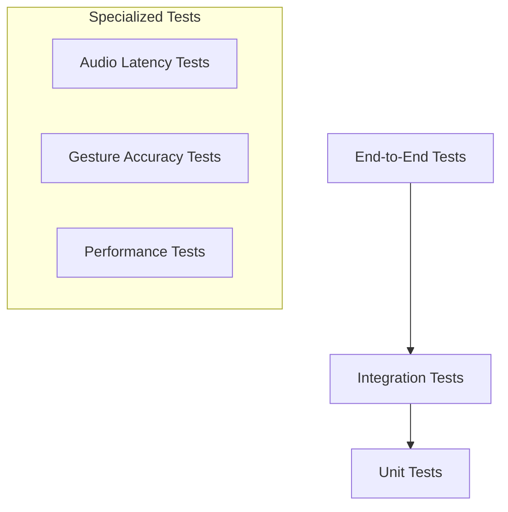

# Testing Documentation

## 1. Overview

AirChord's testing strategy ensures reliability, performance, and quality across all platforms. The testing pyramid includes unit tests, integration tests, end-to-end tests, performance tests, and specialized audio/gesture testing.

---

## 2. Testing Strategy



### 2.1 Testing Pyramid

| Level | Count | Speed | Coverage |
|-------|-------|-------|----------|
| Unit Tests | 1000+ | <1ms each | 80%+ |
| Integration Tests | 100+ | <100ms each | 60%+ |
| E2E Tests | 50+ | <5s each | Critical paths |
| Performance Tests | 20+ | Varies | Benchmarks |

---

## 3. Unit Testing

### 3.1 Framework

| Tool | Purpose |
|------|---------|
| Vitest | Test runner (fast, Vite-native) |
| Testing Library | Component testing |
| Jest DOM | DOM assertions |
| MSW | API mocking |

### 3.2 Unit Test Categories

#### Gesture Recognition Tests

```typescript
describe('GestureClassifier', () => {
  it('should classify open palm as C major', () => {
    const landmarks = mockOpenPalmLandmarks();
    const result = classifyGesture(landmarks);
    expect(result.chord).toBe('C');
    expect(result.confidence).toBeGreaterThan(0.8);
  });

  it('should classify fist as G major', () => {
    const landmarks = mockFistLandmarks();
    const result = classifyGesture(landmarks);
    expect(result.chord).toBe('G');
  });

  it('should reject low confidence gestures', () => {
    const landmarks = mockAmbiguousLandmarks();
    const result = classifyGesture(landmarks);
    expect(result.confidence).toBeLessThan(0.65);
    expect(result.chord).toBeNull();
  });
});
```

#### Audio Engine Tests

```typescript
describe('AudioEngine', () => {
  it('should play C major chord within 50ms', async () => {
    const startTime = performance.now();
    await audioEngine.playChord('C');
    const latency = performance.now() - startTime;
    expect(latency).toBeLessThan(50);
  });

  it('should apply capo transposition correctly', () => {
    const notes = audioEngine.getChordNotes('C', 3);
    expect(notes).toEqual(['D#', 'G', 'A#', 'D#', 'G']);
  });

  it('should maintain tempo accuracy', () => {
    const metronome = new Metronome(120);
    const intervals = metronome.record(10);
    const avgInterval = average(intervals);
    expect(avgInterval).toBeCloseTo(500, 10); // 500ms per beat
  });
});
```

#### Chord Theory Tests

```typescript
describe('ChordUtils', () => {
  it('should transpose chord correctly', () => {
    expect(transposeChord('C', 2)).toBe('D');
    expect(transposeChord('G', -1)).toBe('F#');
  });

  it('should identify chord quality', () => {
    expect(getChordQuality('C')).toBe('major');
    expect(getChordQuality('Am')).toBe('minor');
    expect(getChordQuality('G7')).toBe('dominant7');
  });
});
```

---

## 4. Integration Testing

### 4.1 API Integration Tests

```typescript
describe('Song API', () => {
  it('should create and retrieve a song', async () => {
    const song = await api.createSong({
      title: 'Test Song',
      key: 'C',
      tempo: 120,
      chords: [{ chord: 'C', measure: 1 }]
    });

    const retrieved = await api.getSong(song.id);
    expect(retrieved.title).toBe('Test Song');
  });

  it('should enforce authentication', async () => {
    const response = await api.createSong({ title: 'Test' }, { auth: false });
    expect(response.status).toBe(401);
  });
});
```

### 4.2 Database Integration Tests

```typescript
describe('Prisma Database', () => {
  it('should create user with preferences', async () => {
    const user = await prisma.user.create({
      data: {
        email: 'test@example.com',
        preferences: {
          create: { theme: 'dark', audioQuality: 'high' }
        }
      },
      include: { preferences: true }
    });

    expect(user.preferences.theme).toBe('dark');
  });
});
```

---

## 5. End-to-End Testing

### 5.1 Framework

| Tool | Purpose |
|------|---------|
| Playwright | Cross-browser E2E testing |
| Cypress | Component E2E testing |
| Percy | Visual regression |

### 5.2 Critical User Flows

```typescript
test('complete practice session flow', async ({ page }) => {
  // Login
  await page.goto('/auth/login');
  await page.fill('[data-testid="email"]', 'test@example.com');
  await page.fill('[data-testid="password"]', 'password123');
  await page.click('[data-testid="login-btn"]');
  
  // Navigate to practice
  await page.click('[data-testid="nav-practice"]');
  await expect(page.locator('h1')).toContainText('Practice Mode');
  
  // Select chord trainer
  await page.click('[data-testid="chord-trainer"]');
  await page.click('[data-testid="start-practice"]');
  
  // Verify metronome starts
  await expect(page.locator('[data-testid="metronome"]')).toBeVisible();
  
  // Complete session
  await page.click('[data-testid="stop-practice"]');
  await expect(page.locator('[data-testid="score"]')).toBeVisible();
});
```

### 5.3 Visual Regression Tests

| Page | Viewport | Threshold |
|------|----------|-----------|
| Home | 1920×1080 | 0.1% |
| Practice | 1920×1080 | 0.1% |
| Recording | 1920×1080 | 0.1% |
| Mobile Home | 375×812 | 0.1% |
| Mobile Practice | 375×812 | 0.1% |

---

## 6. Performance Testing

### 6.1 Audio Latency Tests

```typescript
describe('Audio Latency', () => {
  it('should achieve <50ms end-to-end latency', async () => {
    const results = await measureLatency({
      iterations: 100,
      method: 'AudioContext.currentTime'
    });

    const p50 = percentile(results, 50);
    const p90 = percentile(results, 90);
    const p99 = percentile(results, 99);

    expect(p50).toBeLessThan(30);  // Target: 30ms
    expect(p90).toBeLessThan(50);  // Target: 50ms
    expect(p99).toBeLessThan(100); // Max: 100ms
  });
});
```

### 6.2 Gesture Recognition Performance

```typescript
describe('Gesture Performance', () => {
  it('should process frames at 30fps', async () => {
    const fps = await measureFPS({
      duration: 10000, // 10 seconds
      method: 'requestAnimationFrame'
    });

    expect(fps).toBeGreaterThanOrEqual(28); // Allow 2fps drop
  });

  it('should detect gesture within 50ms', async () => {
    const latency = await measureGestureDetectionLatency({
      gesture: 'open_palm',
      iterations: 50
    });

    expect(latency.p90).toBeLessThan(50);
  });
});
```

### 6.3 Memory Usage Tests

```typescript
describe('Memory Management', () => {
  it('should not leak memory during extended use', async () => {
    const initialMemory = performance.memory.usedJSHeapSize;
    
    // Simulate 5 minutes of use
    await simulatePracticeSession(300);
    
    const finalMemory = performance.memory.usedJSHeapSize;
    const memoryGrowth = finalMemory - initialMemory;
    
    // Should not grow more than 50MB
    expect(memoryGrowth).toBeLessThan(50 * 1024 * 1024);
  });
});
```

### 6.4 Bundle Size Tests

```typescript
describe('Bundle Size', () => {
  it('should keep initial bundle under 500KB', () => {
    const bundleSize = getBundleSize('main.js');
    expect(bundleSize).toBeLessThan(500 * 1024);
  });

  it('should lazy load audio engine', () => {
    const audioBundle = getBundleSize('audio-engine.js');
    expect(audioBundle).not.toBeInInitialLoad();
  });
});
```

---

## 7. Gesture Accuracy Testing

### 7.1 Test Dataset

| Gesture | Test Samples | Required Accuracy |
|---------|--------------|-------------------|
| C Major (open palm) | 100 | >95% |
| G Major (fist) | 100 | >95% |
| D Major (peace) | 100 | >90% |
| A Major (point) | 100 | >90% |
| Am (OK sign) | 100 | >85% |
| Em (three fingers) | 100 | >85% |

### 7.2 Test Conditions

| Condition | Lighting | Background | Expected Accuracy |
|-----------|----------|------------|-------------------|
| Ideal | Bright, even | Plain | >95% |
| Moderate | Indoor | Cluttered | >90% |
| Challenging | Dim | Moving | >80% |
| Extreme | Very dim | Complex | >70% |

### 7.3 Cross-Device Testing

| Device | Camera | Expected Accuracy |
|--------|--------|-------------------|
| iPhone 14+ | TrueDepth | >95% |
| iPhone 12-13 | Standard | >90% |
| Pixel 7+ | Standard | >90% |
| Samsung S22+ | Standard | >90% |
| Budget Android | VGA | >75% |
| Desktop Webcam | 1080p | >85% |

---

## 8. Accessibility Testing

### 8.1 Automated Checks

```typescript
describe('Accessibility', () => {
  it('should have no critical axe violations', async ({ page }) => {
    await page.goto('/');
    const results = await page.accessibility.snapshot();
    expect(results.violations.filter(v => v.impact === 'critical')).toHaveLength(0);
  });

  it('should support keyboard navigation', async ({ page }) => {
    await page.goto('/');
    await page.keyboard.press('Tab');
    expect(await page.evaluate(() => document.activeElement.tagName)).toBe('BUTTON');
  });
});
```

### 8.2 Manual Accessibility Checklist

| Check | Method |
|-------|--------|
| Screen reader (VoiceOver) | Manual test |
| Screen reader (NVDA) | Manual test |
| Keyboard only navigation | Manual test |
| 200% zoom | Visual check |
| High contrast mode | Visual check |
| Reduced motion | Visual check |

---

## 9. Cross-Browser Testing

### 9.1 Browser Matrix

| Browser | Version | Priority | Platform |
|---------|---------|----------|----------|
| Chrome | Latest 2 | P0 | Desktop, Android |
| Safari | Latest 2 | P0 | iOS, macOS |
| Firefox | Latest 2 | P1 | Desktop |
| Edge | Latest 2 | P1 | Desktop |
| Samsung Internet | Latest | P1 | Android |
| Opera | Latest | P2 | Desktop |

### 9.2 Feature Compatibility

| Feature | Chrome | Safari | Firefox | Edge |
|---------|--------|--------|---------|------|
| Web Audio API | ✅ | ✅ | ✅ | ✅ |
| MediaPipe | ✅ | ⚠️ | ✅ | ✅ |
| WebRTC | ✅ | ✅ | ✅ | ✅ |
| Service Worker | ✅ | ✅ | ✅ | ✅ |
| WebGL | ✅ | ✅ | ✅ | ✅ |

---

## 10. CI/CD Testing

### 10.1 GitHub Actions Pipeline

```yaml
name: Test Pipeline
on: [push, pull_request]

jobs:
  unit-tests:
    runs-on: ubuntu-latest
    steps:
      - uses: actions/checkout@v4
      - uses: actions/setup-node@v4
      - run: npm ci
      - run: npm run test:unit
      - run: npm run test:coverage

  integration-tests:
    runs-on: ubuntu-latest
    needs: unit-tests
    steps:
      - run: npm run test:integration

  e2e-tests:
    runs-on: ubuntu-latest
    needs: unit-tests
    steps:
      - run: npx playwright install
      - run: npm run test:e2e

  performance-tests:
    runs-on: ubuntu-latest
    needs: unit-tests
    steps:
      - run: npm run test:performance
```

### 10.2 Quality Gates

| Gate | Threshold | Action on Fail |
|------|-----------|----------------|
| Code Coverage | >80% | Block merge |
| Lighthouse Score | >90 | Block deploy |
| Bundle Size | <500KB | Warning |
| Test Pass Rate | 100% | Block merge |
| Accessibility Score | >95 | Block deploy |

---

## 11. Monitoring & Observability

### 11.1 Production Monitoring

| Tool | Purpose |
|------|---------|
| Sentry | Error tracking |
| LogRocket | Session replay |
| PostHog | Analytics |
| Vercel Analytics | Performance |

### 11.2 Key Metrics

| Metric | Target | Alert Threshold |
|--------|--------|-----------------|
| Error Rate | <0.1% | >1% |
| P95 Latency | <50ms | >100ms |
| Crash Rate | <0.5% | >1% |
| Uptime | 99.9% | <99.5% |
